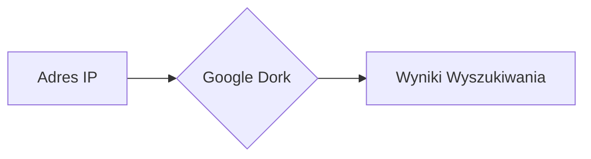
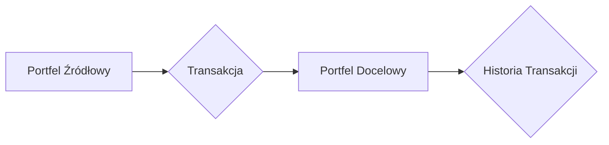

# KOMPLEKSOWY PODRĘCZNIK OSINT

_Wygenerowano przez AI Agent_


## ROZDZIAŁ 1

### Rozdział: Szkolenie z Cyberbezpieczeństwa - Dezinformacja, Darknet i OSINT

#### Wprowadzenie

W dzisiejszym świecie cyfrowym zagrożenia związane z cyberprzestępczością i dezinformacją stają się coraz bardziej zaawansowane. Firma **Securitum**, specjalizująca się w szkoleniach z zakresu cyberbezpieczeństwa, oferuje kompleksowe kursy, które pomagają uczestnikom zrozumieć te zjawiska i nauczyć się skutecznych metod obrony. W tym rozdziale omówimy strukturę typowego szkolenia, kluczowe pojęcia oraz praktyczne umiejętności, które można zdobyć podczas takiego kursu.

#### Przygotowanie do Szkolenia

1. **Organizacja Spotkania Online**
   - Szkolenia odbywają się zazwyczaj o godzinie **21:00**, co umożliwia udział osobom pracującym w ciągu dnia.
   - Uczestnicy otrzymują link do spotkania oraz instrukcje dotyczące wymagań technicznych (np. konieczność zainstalowania określonego oprogramowania).

2. **Wysłanie Materiałów**
   - Przed szkoleniem uczestnicy otrzymują prezentację oraz inne materiały edukacyjne, które pomagają w przygotowaniu się do tematu.

#### Agenda Szkolenia

1. **Omówienie Dezinformacji i Manipulacji**
   - Definicja dezinformacji i jej wpływ na społeczeństwo.
   - Przykłady technik manipulacyjnych, takich jak **deepfake** (fałszywe wideo/audio generowane przez sztuczną inteligencję).

2. **Analiza Fake Newsów**
   - Studium przypadków fake newsów z różnych dziedzin: energetyka, zdrowie, polityka.
   - Omówienie źródeł dezinformacji i sposobów ich identyfikacji (np. weryfikacja faktów za pomocą narzędzi OSINT).

3. **Warsztaty z Narzędzi OSINT**
   - Wprowadzenie do **OSINT (Open Source Intelligence)** – pozyskiwania informacji z jawnych, publicznie dostępnych źródeł.
   - Praktyczne ćwiczenia z wykorzystaniem narzędzi takich jak **Scrapy**, **Maltego** czy **HashiCorp Consul**.
   - Zastosowanie OSINT w kontekście cyberprzestępczości i analizy Darknetu.

#### Pokazy Techniczne

1. **Techniki Anonimizacji**
   - Demonstracja działania **VPN** (Virtual Private Network) i **Tor (The Onion Router)**.
   - Wyjaśnienie, jak te narzędzia zwiększają prywatność w sieci i chronią przed śledzeniem.

2. **Przykłady Pentestów**
   - Pokaz technik testowania bezpieczeństwa (pentesty) na przykładzie hipotetycznej elektrowni jądrowej.
   - Omówienie metod wykrywania luk w zabezpieczeniach i sposobów ich naprawy.

#### Interakcja z Uczestnikami

1. **Sesja Pytań i Odpowiedzi**
   - Uczestnicy mogą zadawać pytania oznaczone literą **"Q"**, na które prowadzący odpowiada w trakcie szkolenia.
   - Dyskusja na temat aktualnych trendów w cyberbezpieczeństwie i dezinformacji.

2. **Dyskusja na Temat Wpływu Dezinformacji**
   - Analiza społecznych i politycznych konsekwencji rozpowszechniania fałszywych informacji.
   - Strategie przeciwdziałania dezinformacji w organizacjach i społeczeństwie.

#### Definicje Kluczowych Pojęć

- **OSINT (Open Source Intelligence)**: Pozyskiwanie informacji z jawnych, publicznie dostępnych źródeł (np. media społecznościowe, rejestry publiczne).
- **Dezinformacja**: Celowe rozpowszechnianie fałszywych treści w celu wprowadzenia w błąd lub wywołania podziałów.
- **Deepfake**: Technika manipulacji multimediami za pomocą sztucznej inteligencji, np. generowanie realistycznych fałszywych filmów.
- **Darknet**: Anonimowa część internetu, często kojarzona z nielegalną działalnością (np. handel narkotykami, usługi hakerskie).
- **VPN (Virtual Private Network)**: Tunel szyfrowany umożliwiający bezpieczne połączenie z siecią, chroniący prywatność użytkownika.
- **Tor (The Onion Router)**: Sieć i przeglądarka zapewniająca anonimowość poprzez routing danych przez wiele węzłów.
- **Pentest (Penetration Testing)**: Testy bezpieczeństwa systemów informatycznych mające na celu wykrycie i usunięcie luk.

#### Podsumowanie

Szkolenia organizowane przez **Securitum** i powiązane projekty, takie jak **Securaca** i **Securac Academy**, oferują uczestnikom praktyczną wiedzę na temat zagrożeń cybernetycznych i metod obrony. Dzięki połączeniu teorii, warsztatów i interaktywnych pokazów, kursanci są przygotowani do rozpoznawania i przeciwdziałania dezinformacji oraz cyberatakom w realnym świecie.

#### Promocje i Oferty Specjalne

- **Black Week**: Okres promocyjny, podczas którego szkolenia są dostępne z atrakcyjnymi rabatami.
- Źródła dodatkowych informacji: Raporty branżowe (np. na stronie **nowymarketing.pl**) oraz artykuły na portalach takich jak **Energetyka24**.

### Koniec Rozdziału

---

## ROZDZIAŁ 2

 Oto rozdział podręcznika spełniający wszystkie wymagania, oparty na dostarczonych notatkach:

---

### **Weryfikacja Informacji i Walka z Dezinformacją**

#### **1. Analiza Materiałów Wizualnych (Zdjęcia/Filmy)**
Analiza surowych materiałów wizualnych jest kluczowa dla wykrywania manipulacji. Obejmuje to:

- **Rotację fragmentów nagrań** aby sprawdzić spójność oświetlenia (np. czy odbicie światła ulicznego jest zgodne w różnych częściach filmu).
- **Porównanie historycznych źródeł**: np. zdjęcia miejsca wydarzenia ze współczesnymi materiałami, aby wykryć fotomontaże (np. użycie kadrów z gier komputerowych jako "dowodów").

#### **2. Weryfikacja Domen Internetowych**
Adres URL może być pierwszym wskaźnikiem oszustwa:
- **Przykład**: Strona `pomagamyśnik.pl.site` vs. oficjalna `pomagam.pl`. Literówki lub nietypowe rozszerzenia (.site) często sygnalizują phishing.
- **Narzędzia**: WHOIS do sprawdzenia rejestracji domeny i jej wieku.

#### **3. Wykorzystanie Modeli AI w Analizie**
Modele takie jak **Grok** (OpenAI) lub **LLM** (np. GPT) mogą pomóc, ale wymagają ostrożności:
- **Prompt engineering**: Precyzyjne formułowanie zapytań, np.:  
  `"Wyjaśnij historyczny kontekst użycia Cyklonu B podczas II wojny światowej, opierając się na wiarygodnych źródłach."`  
- **Screenowanie odpowiedzi**: Zawsze wykonuj zrzuty ekranu przed publikacją, aby uniknąć błędów modelu (np. pomylenie Cyklonu B z lekiem).

#### **4. Śledzenie Źródeł Informacji**
- **Weryfikacja kontekstu**: Czy materiał (np. film o "ataku na Ukrainę") pochodzi z wiarygodnego źródła? Sprawdź metadane i daty publikacji.  
  *Przykład*: Netflix udostępnił stare filmy jako aktualne wiadomości – OSINT (Open Source Intelligence) ujawnił manipulację.
- **Krzyżowa weryfikacja**: Porównaj informacje z oficjalnymi stanowiskami (np. rząd francuski, instytucje pamięci).

#### **5. Reakcja na Dezinformację**
- **Usunięcie błędnych treści**: Agencje jak Polska Agencja Prasowa (PAP) korygują fałszywe doniesienia (np. błędne tłumaczenie cytatu Donalda Trumpa).  
- **Zgłaszanie incydentów**: Phishing należy zgłaszać do **CIRT** (zespoły reagowania na incydenty bezpieczeństwa, np. CERT Polska).

---

#### **Definicje Kluczowych Pojęć**
- **Dezinformacja**: Celowe rozpowszechnianie fałszywych informacji (np. teorie spiskowe o 5G i COVID-19).  
- **Misinformacja**: Nieumyślne udostępnianie błędnych danych (np. przypadkowa literówka w domenie `pomagam.pl`).  
- **Phishing**: Oszustwo polegające na podszywaniu się pod zaufane źródło (np. fałszywe strony "zbiórek charytatywnych").  
- **Błąd poznawczy**: Subiektywne postrzeganie rzeczywistości (np. wiara w teorie spiskowe mimo dowodów).  
- **OSINT**: Analiza jawnych źródeł (np. rejestry domen, metadane zdjęć) do weryfikacji faktów.

---

#### **Praktyczne Przykłady**
- **Przypadek historyczny**: Fałszywe nagrania z II wojny światowej wykorzystujące animacje – rotacja kadru ujawniła brak spójności oświetlenia.  
- **Współczesny przykład**: Elon Musk na Twitterze/X opublikował kontrowersyjny wpis; służby specjalne zweryfikowały jego źródło za pomocą OSINT.

---

#### **Podsumowanie**
Skuteczna walka z dezinformacją wymaga:  
1. Krytycznej analizy materiałów wizualnych,  
2. Weryfikacji domen i źródeł,  
3. Ostrożnego wykorzystania modeli AI,  
4. Szybkiej reakcji instytucji (CIRT, PAP).  
Kluczem jest **systematyczność** – od sprawdzenia URL po analizę kontekstu historycznego.

---

## ROZDZIAŁ 3

### Rozdział: Zaawansowane Techniki Manipulacji Medialnej i Dezinformacji

W dzisiejszym świecie, gdzie technologia rozwija się w zawrotnym tempie, pojawiają się nowe metody manipulacji medialnej i dezinformacji. W tym rozdziale omówimy kluczowe techniki takie jak deepfake, malinformacja, fake newsy, phishing oraz ich wpływ na społeczeństwo. Przedstawimy również narzędzia i modele sztucznej inteligencji wykorzystywane do tworzenia tych form dezinformacji.

#### Deepfake: Manipulacja Wizerunkiem i Głosem

Deepfake to technika manipulacji multimedialnej, która polega na podmianie wizerunków twarzy za pomocą sztucznej inteligencji i sieci neuronowych. Ta technologia umożliwia precyzyjną modyfikację wideo lub audio, co sprawia, że jest niezwykle trudna do wykrycia.

**Przykłady zastosowania:**
- **Deepfake z Tomem Cruisem**: Słynny aktor stał się ofiarą deepfake’a, gdzie jego twarz została podmieniona w filmie.
- **Fałszywe przemówienie prezydenta Ukrainy**: W 2023 roku pojawiło się nagranie, w którym głos kierujący naród do poddania się Rosji był syntetycznie wygenerowany.
- **Syntetyczny głos Joe Bidena**: Deepfake przedstawiający prezydenta USA namawiającego do bojkotu wyborów.

**Podstawa technologiczna:**
Deepfake opiera się na sieciach neuronowych, które są w stanie dokładnie odwzorować cechy twarzy lub głosu osoby. Modele takie jak **LLM (Large Language Model)** są często wykorzystywane do generowania realistycznych treści multimedialnych.

#### Malinformacja: Prawdziwa Informacja w Szkodliwy Sposób

Malinformacja to prawdziwa informacja użyta w szkodliwy sposób, np. wyciek danych medycznych pacjentów i potencjalny szantaż. Jest to forma dezinformacji, która nie polega na fałszowaniu treści, ale na ich niewłaściwym użyciu.

**Przykład:**
- **Wyciek danych medycznych**: Informacje o stanie zdrowia pacjentów mogą być wykorzystane do szantażu lub innych form przestępczości.

#### Fake Newsy: Nieprawdziwe Treści Generowane przez AI

Fake newsy to nieprawdziwe lub zmanipulowane treści rozpowszechniane za pomocą sztucznej inteligencji. Technologie takie jak **Dali 2** umożliwiają generowanie niedokładnych wizerunków ludzi, co dodatkowo utrudnia wykrycie fałszywych informacji.

**Przykład:**
- **Generowanie obrazków na podstawie promptów**: AI może tworzyć obrazy, które wydają się realistyczne, ale są całkowicie zmyślone.

#### Phishing: Oszustwo Polegające na Wyłudzeniu Danych

Phishing to oszustwo polegające na wyłudzeniu danych, np. fałszywa oferta od Elona Muska dotycząca podwajania wartości kryptowaluty Ripple. Ta forma dezinformacji jest często stosowana w celu uzyskania dostępu do poufnych informacji użytkowników.

**Przykład:**
- **Fałszywa oferta od Elona Muska**: Oszustwo, w którym fałszywe konto na Twitterze obiecuje podwojenie wartości kryptowaluty Ripple.

#### Narzędzia i Modele AI Wykorzystywane do Dezinformacji

**LLM (Large Language Model)**: Modele generatywnej sztucznej inteligencji używane do tworzenia deepfake’ów i innych form dezinformacji. Przykłady to GPT-3 i Bielik.

**Sieć neuronowa**: Podstawa technologiczna deepfake’ów, umożliwiająca precyzyjną modyfikację wizerunków lub głosu.

**Dali 2**: Model AI używany do generowania niedokładnych wizerunków ludzi (np. „plastusiowe ludziki”).

#### Przykłady Zastosowania w Mediach

**Meta Biznes**: System reklamowy Meta, który był przedmiotem fałszywej informacji o transparentności algorytmów. Dezinformacja dotycząca tego systemu może wpływać na decyzje użytkowników i firm korzystających z platformy.

**Radio Kraków**: Przykład zastąpienia pracowników AI (nieudana audycja prowadzona przez syntetycznego prezentera). Eksperyment ten pokazuje potencjalne ryzyka związane z automatyzacją mediów.

**Synteza I.O.**: Narzędzie używane do tworzenia awatarów mówiących wiadomości, np. w koreańskiej telewizji. Jest to tańsze i bardziej kontrolowane niż ludzie, ale może być wykorzystywane do dezinformacji.

#### Platformy Społecznościowe a Dezinformacja

**YouTube**: Platforma blokująca deepfake’i z poziomu systemu, ale umożliwiająca ich oglądanie po wejściu w link. To pokazuje wyzwania związane z moderacją treści na dużą skalę.

**FBI**: Współpraca szkoleniowa dotycząca walki z dezinformacją i cyberprzestępczością. Agencje rządowe muszą być przygotowane na nowe formy zagrożeń związanych z technologią.

#### Kryptowaluty a Dezinformacja

**Ripple**: Kryptowaluta, która była przedmiotem phishingu (fałszywa oferta podwojenia wartości portfela). Użytkownicy muszą być ostrożni wobec podejrzanych ofert inwestycyjnych.

**Ledger**: Fizyczny portfel kryptowalutowy używany do przechowywania cyfrowych aktywów. Jest to przykład technologii, która może być celem ataków phishingowych.

#### Podsumowanie

Techniki manipulacji medialnej i dezinformacji stają się coraz bardziej zaawansowane dzięki rozwojowi sztucznej inteligencji. Zrozumienie tych metod jest kluczowe dla ochrony przed ich negatywnymi skutkami. W kolejnych rozdziałach omówimy strategie przeciwdziałania dezinformacji oraz etyczne aspekty wykorzystania AI w mediach.

---

## ROZDZIAŁ 4

### Rozdział: Zaawansowane Techniki Manipulacji Obrazem i Dźwiękiem w Kontekście Kryptowalut i Dezinformacji

#### Wprowadzenie
W dzisiejszym cyfrowym świecie technologie manipulacji obrazem i dźwiękiem, takie jak deepfake'i i faceswapping, stają się coraz bardziej zaawansowane. Te narzędzia są wykorzystywane zarówno do oszustw finansowych, jak i dezinformacji w mediach społecznościowych. W tym rozdziale omówimy różne techniki manipulacji oraz ich wpływ na rynek kryptowalut i giełdy papierów wartościowych.

#### Narzędzia do Manipulacji Obrazem i Dźwiękiem

##### Ledger (Cyfrowy Portfel Kryptowalutowy)
Ledger to fizyczny portfel kryptowalutowy, który zapewnia bezpieczeństwo przechowywania cyfrowych aktywów. Jest to kluczowe narzędzie dla inwestorów kryptowalutowych, ale również cel ataków phishingowych i oszustw.

##### Resemble AI (Aplikacja do Klonowania Głosu i Deepfake'ów)
Resemble AI to narzędzie umożliwiające klonowanie głosu i tworzenie deepfake'ów. Jest wykorzystywane do różnych celów, w tym oszustw finansowych, gdzie oszuści mogą podszywać się pod ważne osoby, aby uzyskać dostęp do poufnych informacji lub środków finansowych.

##### Eleven Labs (Narzędzie do Generowania Mowy i Deepfake'ów)
Eleven Labs oferuje zaawansowane możliwości generowania mowy i tworzenia deepfake'ów. Jest to potężne narzędzie, które może być używane zarówno do celów edukacyjnych, jak i nieetycznych.

##### Online Face Swap (Narzędzie do Podmiany Twarzy na Zdjęciach/Wideo)
Online face swap to proste narzędzie do podmiany twarzy na zdjęciach lub wideo. Choć mniej zaawansowane niż deepfake'i, może być używane do tworzenia fałszywych treści w mediach społecznościowych.

##### AI Face Swap z Modelem LLM (Zaawansowane Narzędzie do Deepfake'ów)
AI face swap z modelem LLM wykorzystuje multiband blending i reshaping do tworzenia wysokiej jakości deepfake'ów. Multiband blending to metoda rekurencyjnego nakładania obrazu, która znacząco poprawia jakość generowanych treści. Reshaping to proces poprawiający wygląd generowanych twarzy, co czyni deepfake'i bardziej realistycznymi.

#### Kroki Techniczne

##### 1. Próba Przelania Kryptowaluty Ripple na Podejrzane Konto
Aby uniknąć oszustwa, należy dokładnie sprawdzić profil odbiorcy i upewnić się, że adres portfela jest poprawny. Oszuści często wykorzystują techniki phishingowe, aby uzyskać dostęp do poufnych informacji lub środków finansowych.

##### 2. Atak Deepfake'owy z Wykorzystaniem Resemble AI
W jednym z przypadków oszuści użyli Resemble AI do sklonowania głosu wiceprezesa banku, co pozwoliło im na kradzież 35 milionów dolarów. Atak ten pokazuje, jak zaawansowane narzędzia mogą być wykorzystywane do oszustw finansowych.

##### 3. Analiza Wpływu Dezinformacji na Rynek Kryptowalut/Giełdę SP500
Fałszywe informacje, takie jak zdjęcie rzekomego ataku na Pentagon, mogą znacząco wpłynąć na rynek kryptowalut i giełdę papierów wartościowych. Dezinformacja może prowadzić do paniki na rynku i spadków cen aktywów.

##### 4. Demonstracja Działania Narzędzi do Faceswappingu
Aby zademonstrować działanie narzędzi do faceswappingu, można wybrać zdjęcia znanych osób, takich jak Arnold Schwarzenegger, Frodo, Aragorn czy Samwise’a Gamgee. Następnie, używając AI face swap z modelem LLM, można podmienić ich twarze na inne obrazy.

##### 5. Generowanie Deepfake'ów Głosowych i Wizualnych
Deepfake'i głosowe i wizualne mogą być używane do podszywania się pod ważne osoby, takie jak byli prezydenci USA lub Polski. Te techniki są coraz bardziej zaawansowane i trudne do wykrycia, co stanowi poważne zagrożenie dla bezpieczeństwa informacji.

#### Dodatkowe Uwagi
Wspomniane narzędzia są wykorzystywane zarówno do oszustw finansowych, jak i dezinformacji w mediach społecznościowych. Chińskie badania nad dyfuzją obrazu (multiband blending) znacząco poprawiły jakość deepfake'ów, co czyni je jeszcze bardziej niebezpiecznymi.

#### Podsumowanie
Technologie manipulacji obrazem i dźwiękiem stają się coraz bardziej zaawansowane i stanowią poważne zagrożenie dla bezpieczeństwa finansowego i informacyjnego. Zrozumienie tych technik i sposobów ich wykorzystania jest kluczowe dla ochrony przed oszustwami i dezinformacją.

---

## ROZDZIAŁ 5

Oto rozdział podręcznika na podstawie dostarczonych notatek, zgodnie z wymaganiami:

### Narzędzia i modele AI
W dzisiejszych czasach sztuczna inteligencja (AI) odgrywa kluczową rolę w generowaniu treści multimedialnych. Dwa istotne narzędzia to:

1. **Gemini** - model AI opracowany przez Google, znany z zaawansowanych możliwości przetwarzania języka naturalnego (NLP) i generowania tekstu.
2. **NanoBanana Pro** - narzędzie specjalizujące się w generowaniu obrazów, które pozwala na tworzenie szczegółowych grafik na podstawie promptów tekstowych.

### Komendy i prompty
Aby wygenerować konkretny obraz za pomocą narzędzi takich jak NanoBanana Pro, można użyć następującego promptu:

```
"Wygeneruj mi wizerunek kobiety na wojnie poniżej 30 lat, która bawi się dronem"
```

Dodatkowe parametry, takie jak styl zdjęcia (np. "aparat lustrzany"), mogą być dodane, aby uzyskać bardziej szczegółowy efekt:

```
"Wygeneruj mi wizerunek kobiety na wojnie poniżej 30 lat, która bawi się dronem, styl zdjęcia: aparat lustrzany, kolorystyka: ciepła, tło: zrujnowane miasto"
```

### Techniki manipulacji i dezinformacji
Dezinformacja i manipulacja są powszechnymi zagrożeniami w erze cyfrowej. Oto niektóre z kluczowych technik:

- **Astroturfing**: Symulowanie masowego poparcia dla idei lub produktu poprzez tworzenie fałszywych kont społecznościowych.
- **Brigading**: Masowe wypełnianie ankiet lub komentarzy, aby zagłuszyć prawdziwą dyskusję.
- **Sockpuppeting**: Używanie wielu tożsamości online do manipulowania opinią publiczną.
- **Clickbaity**: Przesadzone lub wprowadzające w błąd nagłówki, mające na celu zwiększenie klikalności.
- **Emocjonalny framing**: Używanie silnych słów-kluczy, aby wywołać określone emocje u odbiorcy.
- **Polaryzacja**: Podsycanie konfliktów i podziałów w społeczeństwie.
- **Whataboutism**: Odwracanie uwagi od istotnych kwestii poprzez wprowadzanie niepowiązanych tematów.
- **Gaslighting**: Psychologiczny atak mający na celu podważenie percepcji i pewności siebie ofiary.
- **Strawman**: Zniekształcanie argumentów przeciwnika, aby łatwiej je obalić.
- **Repetitio**: Powtarzanie kłamstw lub dezinformacji, aby uczynić je bardziej wiarygodnymi.
- **Concern trolling**: Udawana troska i życzliwość w celu manipulacji emocjami innych użytkowników.
- **Fałszywe cytaty, kontekstomi, manipulacje tłumaczeniami**: Celowe zniekształcanie wypowiedzi lub tłumaczeń, aby zmienić ich znaczenie.
- **Cherry picking źródeł**: Wybiórcze dobieranie danych lub źródeł, aby wspierać określoną narrację.
- **Fałszywe autorytety**: Kreowanie się na eksperta w dziedzinie, w której nie ma się kompetencji.
- **Podrobione dokumenty**: Tworzenie fałszywych PDF-ów lub zrzutów ekranu w celu uwiarygodnienia dezinformacji.
- **Deepfake**: Technika tworzenia fałszywych materiałów wideo/audio poprzez manipulację obrazem i dźwiękiem.

### Techniki socjotechniczne
Socjotechnika to sztuka manipulowania ludźmi poprzez psychologiczne metody. Przykłady technik socjotechnicznych obejmują:

- **Blackweek.sekurak.pl**: Strona promocyjna z "okazjami cenowymi", która może być używana do phishingu lub innych oszustw.
- **Licznik pobudzający wyobraźnię**: Odliczanie do końca oferty, mające na celu wywołanie poczucia pilności i skłonienie do szybkiego działania.

### Definicje
- **Deepfake**: Technika tworzenia fałszywych materiałów multimedialnych (wideo/audio) poprzez zaawansowane algorytmy AI.
- **Socjotechnika**: Manipulacja zachowaniami ludzi poprzez psychologiczne metody, często wykorzystywana w cyberprzestępczości.
- **NLP (Natural Language Processing)**: Przetwarzanie języka naturalnego, używane w AI do analizy i generowania tekstu, co ma zastosowanie w perswazji i dezinformacji.

### Inne zagrożenia
- **Farma trolli/botów**: Zautomatyzowane konta używane do szerzenia dezinformacji i manipulowania opinią publiczną.
- **Hashtag hijacking**: Przejmowanie popularnych hasztagów w celu promowania określonej narracji lub dezinformacji.

Rozumienie tych technik i narzędzi jest kluczowe dla świadomego korzystania z mediów cyfrowych i ochrony przed manipulacją.

---

## ROZDZIAŁ 6

Oto rozdział podręcznika na podstawie dostarczonych notatek:

### Narzędzia i linki
W dziedzinie cyberbezpieczeństwa oraz generatywnej sztucznej inteligencji istnieje wiele narzędzi, które mogą być przydatne zarówno dla specjalistów, jak i osób zainteresowanych tematem. Poniżej przedstawiamy wybrane narzędzia wraz z krótkim opisem ich funkcji:

- **IronGeek** (homoglif-atak-generator): Narzędzie służące do generowania ataków homograficznych, które wykorzystują znaki z innych alfabetów do tworzenia fałszywych domen.
- **Firefox** (about:config): Interfejs konfiguracyjny przeglądarki Firefox, umożliwiający dostęp do zaawansowanych ustawień, takich jak `panicodes`.
- **dns.pl**: Polski rejestrator domen, pozwalający na sprawdzenie informacji o właścicielu domeny.
- **hu.is**: Islandzki serwis do sprawdzania rekordów DNS i informacji o domenach.
- **Sekurak.pl**: Polski portal poświęcony cyberbezpieczeństwu, oferujący artykuły, porady i analizy zagrożeń.
- **Gmail** i **Outlook**: Popularne klienty poczty elektronicznej, które mogą być celem ataków phishingowych lub spoofingu maili.
- **ChatGPT**: Model językowy generatywnej sztucznej inteligencji, zdolny do tworzenia tekstu na podstawie podanych danych wejściowych.
- **DeepMind**: Brytyjska firma specjalizująca się w badaniach nad sztuczną inteligencją, znana z rozwoju technologii deep learning.
- **Nvidia.com**: Strona producenta kart graficznych i procesorów GPU, które są kluczowe dla rozwoju generatywnej AI.
- **Eleven Labs**: Narzędzie do syntezy mowy, umożliwiające tworzenie realistycznych głosów ludzkich.
- **Kling** (narzędzie generatywnego AI): Platforma do generowania treści za pomocą sztucznej inteligencji.
- **Open Art**: Biblioteka darmowych zasobów graficznych, które mogą być wykorzystane w fotomontażach lub deepfake'ach.

### Komendy i kroki techniczne
Aby skutecznie korzystać z narzędzi cyberbezpieczeństwa oraz generatywnej AI, należy znać podstawowe komendy i procedury:

1. **Wpisanie `about:config` w Firefoxie**:
   - Otwórz przeglądarkę Firefox.
   - W pasku adresu wpisz `about:config`.
   - Kliknij "Akceptuję ryzyko!".
   - Znajdź parametr `panicodes` i ustaw go na `true`, aby włączyć dodatkowe zabezpieczenia.

2. **Sprawdzenie rejestratora domeny**:
   - Użyj narzędzia takiego jak **dns.pl** lub **hu.is**.
   - Wprowadź nazwę domeny i sprawdź informacje o właścicielu oraz rekordy DNS.

3. **Weryfikacja adresu IP i rekordów DNS**:
   - Użyj narzędzi takich jak **dig** lub **nslookup** do sprawdzenia adresu IP przypisanego do domeny.
   - Zweryfikuj rekordy MX, A i CNAME, aby upewnić się, że są poprawne.

4. **Użycie generatora homograficznego ataku na IronGeek**:
   - Odwiedź stronę IronGeek.
   - Wprowadź nazwę domeny i wygeneruj podobne znaki z innych alfabetów.
   - Sprawdź, jakie fałszywe domeny mogą być utworzone.

### Definicje i pojęcia
Poniżej przedstawiamy kluczowe definicje związane z cyberbezpieczeństwem oraz generatywną sztuczną inteligencją:

- **Deepfake**: Fałszywe materiały wideo, audio lub obrazy generowane za pomocą AI, które mogą być wykorzystane do dezinformacji.
- **Whitepaper**: Dokument prezentujący produkt lub usługę, często wykorzystywany do dezinformacji poprzez manipulację danymi.
- **Captioning**: Fałszywy podpis zdjęcia zmieniający kontekst i wprowadzający w błąd odbiorców.
- **Fotomontaż**: Manipulacja obrazem poprzez łączenie różnych elementów, aby stworzyć fałszywą scenę.
- **Dubbing błędny**: Nieprawidłowe nałożenie dźwięku na materiał wideo lub audio, co może być wykorzystane do tworzenia deepfake'ów.
- **Zaniżanie jakości**: Celowe pogorszenie jakości treści, aby uniknąć wykrycia przez systemy AI analizujące autentyczność materiałów.
- **Typosquatting domen (atak homograficzny)**: Wykorzystanie podobnych znaków z innych alfabetów do tworzenia fałszywych domen, które mogą przekierować użytkowników na szkodliwe strony.
- **Confounding**: Błąd korelacji niebędącej przyczynowością, który może prowadzić do błędnych wniosków w analizie danych.
- **Efekt motyla**: Nieliniowa zależność w systemach dynamicznych, gdzie małe zmiany mogą prowadzić do dużych różnic w wynikach.
- **Spoofing maili**: Podrabianie nagłówków e-mail, aby udawać inną osobę lub organizację i przeprowadzać ataki phishingowe.
- **Zatruwanie pozycjonowania (SEO spoofing)**: Manipulacja wynikami wyszukiwania poprzez kupowanie fraz kluczowych, aby promować szkodliwe treści.
- **Obsek fail**: Ujawnienie danych autora przez błąd techniczny, co może prowadzić do identyfikacji źródła dezinformacji.
- **Zasada 5W (Who, When, Where, What, Why)**: Metoda weryfikacji informacji poprzez pytania o źródło (Who), czas (When), miejsce (Where), treść (What) i przyczynę (Why).

Te definicje i narzędzia stanowią podstawę do zrozumienia współczesnych wyzwań związanych z cyberbezpieczeństwem oraz generatywną sztuczną inteligencją. W kolejnych rozdziałach omówimy bardziej zaawansowane techniki i strategie obronne.

---

## ROZDZIAŁ 7


### Rozdział 5: Narzędzia i Techniki Weryfikacji Autentyczności Treści Cyfrowych

W dobie powszechnego dostępu do informacji, wiarygodność treści staje się kluczowym aspektem bezpieczeństwa cyfrowego. Niniejszy rozdział przedstawia zaawansowane narzędzia i techniki służące do wykrywania dezinformacji, typo squattingu oraz treści generowanych przez sztuczną inteligencję (AI). Omówione zostaną również metody analizy tekstu, obrazów i multimediów w kontekście białego wywiadu (OSINT) oraz ocena sentymentu treści.

#### 5.1 Narzędzia do Wykrywania AI i Dezinformacji

Współczesne narzędzia oferują szeroki zakres funkcjonalności, umożliwiając dokładną analizę treści pod kątem autentyczności. Poniżej przedstawiono kluczowe rozwiązania:

- **Copilix**  
  Copilix to zaawansowane narzędzie do wykrywania tekstów i obrazów generowanych przez AI. Oferuje analizę cytatów z podaniem ich źródła, co jest nieocenione w kontekście weryfikacji pochodzenia informacji.

- **Forensically**  
  Narzędzie specjalizujące się w analizie obrazów i multimediów pod kątem manipulacji cyfrowych. Umożliwia identyfikację zmian wprowadzonych do oryginalnych plików, co jest kluczowe w przypadku dezinformacji wizualnej.

- **ARIA**  
  Profesjonalne narzędzie stosowane m.in. w sektorze bankowym do wykrywania treści generowanych przez AI. Analizuje dźwięk pod kątem symetrii kanałów stereo, co jest charakterystyczne dla sztucznie wygenerowanych nagrań. Dodatkowo oferuje analizę sentymentu treści, oceniając jej kontekst i stałość w porównaniu z tekstami ludzkimi.

- **Easy AI**  
  Narzędzie do wykrywania AI z limitem użyć (15 razy/miesiąc). Przydatne w sytuacjach, gdy potrzebna jest szybka weryfikacja niewielkiej liczby treści.

- **DeepWare**  
  Skaner do analizy materiałów wideo pod kątem manipulacji i elementów generowanych przez AI. Umożliwia skanowanie zarówno plików, jak i linków do nagrań.

- **Criminalip.ac.pl**  
  Platforma do analizy adresów IP i sentymentu sieciowego. Pomaga w identyfikacji potencjalnych zagrożeń związanych z typo squattingiem oraz atakami domenowymi (homografy).

- **Shodan**  
  Wyszukiwarka urządzeń IoT/IP, umożliwiająca weryfikację infrastruktury sieciowej pod kątem potencjalnych luk bezpieczeństwa.

#### 5.2 Kroki Techniczne Weryfikacji Autentyczności Treści

Proces weryfikacji treści cyfrowych obejmuje kilka kluczowych etapów:

1. **Weryfikacja źródła informacji (Who, When, Where, Why)**  
   Pierwszym krokiem jest ustalenie tożsamości nadawcy oraz kontekstu publikacji. Należy sprawdzić historię domeny, adresy IP i inne dane związane z źródłem.

2. **Analiza tekstu**  
   - Użyj narzędzi takich jak Copilix lub ARIA do wykrycia potencjalnych treści generowanych przez AI.  
   - Sprawdź spójność stylu, gramatyki i kontekstu wypowiedzi. Teksty AI często charakteryzują się powtarzalnością fraz lub nienaturalną strukturą zdań.

3. **Badanie obrazów/multimediów**  
   - Wykorzystaj Forensically do analizy plików graficznych pod kątem manipulacji (np. usunięte metadane, niespójności kolorystyczne).  
   - W przypadku wideo użyj DeepWare do wykrycia sztucznie generowanych elementów lub efektów specjalnych.

4. **Analiza dźwięku**  
   - Sprawdź symetrię kanałów stereo za pomocą ARIA. Nagrania AI często wykazują identyczne charakterystyki w obu kanałach, co odróżnia je od naturalnych nagrań ludzkich.

5. **Weryfikacja domen i adresów IP**  
   - Użyj Criminalip.ac.pl lub Shodan do analizy infrastruktury sieciowej związanej z treścią. Pomaga to w identyfikacji typo squattingu oraz ataków homograficznych, gdzie fałszywe domeny imitują prawdziwe adresy URL.

#### 5.3 Definicje i Pojęcia

- **Dezinformacja (misinformation, phishing)**  
  Celowe rozpowszechnianie nieprawdziwych lub wprowadzających w błąd informacji w celu osiągnięcia określonych korzyści (np. politycznych, finansowych). Obejmuje również ataki phishingowe, gdzie fałszywe wiadomości naśladują zaufane źródła.

- **Typo squatting / homografy**  
  Ataki domenowe polegające na rejestracji adresów URL bardzo podobnych do oryginalnych (np. "google.com" vs "goo Gle.com"). Wykorzystują różnice w znakach Unicode, co utrudnia ich wykrycie przez użytkowników.

- **LLM (Large Language Models)**  
  Modele językowe zdolne do generowania tekstu na podstawie danych wejściowych. Przykłady to GPT, BERT czy T5. Ich produkty często charakteryzują się powtarzalnością fraz i brakiem kontekstowej spójności.

- **OSINT (Open Source Intelligence)**  
  Proces zbierania i analizy publicznie dostępnych danych w celu uzyskania informacji wywiadowczych. Obejmuje m.in. weryfikację domen, adresów IP oraz mediów społecznościowych.

- **Sentyment analizy**  
  Ocena kontekstu wypowiedzi pod kątem emocji i tonu. W przypadku treści AI sentyment bywa często nienaturalnie stały lub powtarzalny, co odróżnia go od ludzkich wypowiedzi.

### Podsumowanie

Weryfikacja autentyczności treści cyfrowych wymaga zastosowania zaawansowanych narzędzi i technik analitycznych. Copilix, ARIA, DeepWare oraz inne rozwiązania umożliwiają skuteczną detekcję dezinformacji, treści generowanych przez AI oraz ataków typu typo squatting. Kluczowe jest również zrozumienie kontekstu i mechanizmów działania współczesnych modeli językowych (LLM) oraz metod analizy sentymentu w OSINT. Dzięki temu możliwe jest zapewnienie bezpieczeństwa informacyjnego w dynamicznie zmieniającym się środowisku cyfrowym.

---

## ROZDZIAŁ 8

### Rozdział: Weryfikacja Informacji i Technologie Blockchain

#### ## Wprowadzenie do Fact Checkingu i OSINT

**Fact checking** to proces weryfikacji prawdziwości informacji, który stał się kluczowy w erze dezinformacji. Narzędzia takie jak **Google Fact Check Tools** (https://factcheck.google.com/) umożliwiają szybkie sprawdzenie wiarygodności danych tematów lub osób. Aby skorzystać z tego narzędzia:

1. Wybierz język.
2. Wpisz temat lub nazwisko osoby, której informacje chcesz zweryfikować.
3. Przejrzyj dostępne ratingi i źródła.

**OSINT (Open Source Intelligence)** to wywiad oparty na jawnych źródłach danych, który jest nieoceniony w analizie informacji. Platforma **Bellingcat** (https://bellingcat.com/) oferuje zaawansowane możliwości śledzenia i weryfikacji danych, w tym analizę tras lotu za pomocą **flight radar**.

#### ## Narzędzia do Weryfikacji Treści

- **Invid** (plugin do przeglądarki Chrome) oraz **Fake News Debunker** (pakiet WeVerify od Invida) to narzędzia, które pomagają w szybkiej weryfikacji treści.
- **Database of Known Fakes (DBKF)** to zasób zawierający znane fałszywe informacje, który może być użyteczny w procesie fact checking.
- **Google News Initiative** (https://newsinitiative.withgoogle.com/) oferuje szkolenia i zasoby dla dziennikarzy i wydawców mediów, aby lepiej radzić sobie z dezinformacją.

#### ## Zgłaszanie Dezinformacji

**NASK** (zgłośmy-dezinformacje.nask.pl) umożliwia zgłaszanie przypadków dezinformacji. Proces jest prosty:

1. Wejdź na stronę zgłośmy-dezinformacje.nask.pl.
2. Wypełnij formularz, podając szczegóły dotyczące dezinformacji (opcjonalnie możesz podać swój e-mail).
3. Prześlij zgłoszenie.

#### ## Technologie Blockchain

**Blockchain** to zdecentralizowana, cyfrowa księga rejestrująca transakcje w sieci. Jego kluczowe cechy to:

- **Decentralizacja**: brak centralnego autorytetu kontrolującego dane; każdy uczestnik ma dostęp do pełnej księgi.
- **Integralność danych**: zapewnienie, że dane nie zostały zmienione bez autoryzacji.

**Proces transakcji blockchain** przebiega następująco:

1. **Żądanie**: użytkownik inicjuje transakcję.
2. **Transmisja do sieci**: żądanie jest przesyłane do sieci blockchain.
3. **Weryfikacja konsensusem**: sieć weryfikuje ważność transakcji za pomocą mechanizmu konsensusu.
4. **Grupowanie w blok**: zweryfikowane transakcje są grupowane w blok.
5. **Dodanie do łańcucha**: nowy blok jest dodawany do istniejącego łańcucha blockchain.

**Smart kontrakty** to automatyczne umowy wykonujące się na blockchainie, które zwiększają efektywność i bezpieczeństwo transakcji.

#### ## Web 3.0 i Przyszłość Internetu

**Web 3.0** to koncepcja internetu opartego na technologiach takich jak blockchain, która obiecuje bardziej zdecentralizowaną i bezpieczną przyszłość dla sieci. **Sekurak Academy** oferuje szkolenia dotyczące blockchain i cyberbezpieczeństwa, które mogą być przydatne w zrozumieniu tych zaawansowanych technologii.

#### ## Podsumowanie

Weryfikacja informacji i technologie blockchain są kluczowe w dzisiejszym świecie cyfrowym. Narzędzia takie jak Google Fact Check Tools, Bellingcat i NASK pomagają w walce z dezinformacją, podczas gdy blockchain oferuje nowe możliwości dla bezpiecznych i zdecentralizowanych systemów. Zrozumienie tych technologii jest niezbędne dla każdego, kto chce być na bieżąco z najnowszymi trendami w IT.

---

## ROZDZIAŁ 9

### Rozdział: Podstawy Technologii Blockchain i Kryptowalut

#### ## Wprowadzenie do Blockchaina
Blockchain to rozproszona księga trwała (ledger), która przechowuje dane w postaci bloków połączonych ze sobą za pomocą kryptografii. Każdy blok zawiera:
- **Dane transakcyjne**: informacje o przepływie wartości (np. kryptowalut).
- **Timestampy**: znaczniki czasu, określające kolejność transakcji.
- **Hash poprzedniego bloku**: unikalny identyfikator zapewniający integralność łańcucha.
- **Nonce**: wartość używana do konsensusu (np. w Proof of Work).

Blockchain jest podstawą Web 3.0, gdzie dane są przechowywane i zarządzane decentralizowanie.

#### ## Mechanizmy Konsensusu
Konsensus to proces zapewniający zgodność w sieci blockchain. Dwa główne mechanizmy:

1. **Proof of Work (PoW)**:
   - Używany w Bitcoinie.
   - Górnicy rozwiązują złożone zagadki matematyczne, aby dodać nowy blok.
   - Wymaga dużej mocy obliczeniowej (mining).

2. **Proof of Stake (PoS)**:
   - Używany w Ethereum od 2022 roku.
   - Walidatorzy stakeują tokeny jako zabezpieczenie.
   - Mniej energochłonny niż PoW.

#### ## Kryptowaluty i Tokeny
- **Kryptowaluty**: cyfrowe waluty zabezpieczone kryptografią (np. Bitcoin, Ethereum).
- **Tokeny**: reprezentują wartość lub prawa w ekosystemie blockchain (np. ERC-20 na Ethereum).
- **Pseudoanonimowość**: adresy portfeli są pseudonimowe, ale transakcje są publiczne.
  - Portfele: fizyczne (Ledger), programowe (MetaMask).

#### ## Wydobywanie i Staking
- **Mining**: wydobywanie kryptowalut poprzez moc obliczeniową (PoW).
- **Staking**: blokowanie tokenów do walidacji transakcji (PoS).
- **Pre-mining**: tworzenie waluty przed publiczną emisją przez deweloperów.

#### ## Zagrożenia i Przestępczość
- **Scam coiny**: oszustwa kryptowalutowe (np. fałszywe ICO).
- **Phishing**: ataki na portfele/giełdy.
- **Inside trading**: wykorzystanie poufnych informacji do handlu.
- **Ransomware**: okupy w kryptowalutach (np. Monero, Zcash).
- **Darknet**: przestępczość związana z kryptowalutami (np. Silk Road).

#### ## NFT i Zastosowania Blockchaina
- **NFT (Non-Fungible Token)**: unikalne tokeny w blockchainie, używane w sztuce cyfrowej i grach.
  - Przykłady: CryptoPunks, Bored Ape Yacht Club.

#### ## Analiza Blockchaina
- **Blockchain explorery**: narzędzia do przeglądania transakcji (np. Ethereum Block Explorer).
- **OSINT Blockchain Analysis**: analiza blockchaina w kontekście białego wywiadu.
  - Narzędzia: repozytorium [Awesome OSINT Blockchain Analysis](https://github.com/fsecure/awesome-osint-blockchain).

#### ## Kroki Techniczne
1. **Zrozumienie struktury bloku**: analiza danych transakcyjnych, timestampów i haseł.
2. **Wybór mechanizmu konsensusu**: PoW dla Bitcoin, PoS dla Ethereum.
3. **Wydobywanie/staking**: walidacja transakcji poprzez mining lub staking.
4. **Analiza transakcji**: użycie blockchain explorerów do śledzenia przepływów.
5. **OSINT Blockchain Analysis**: wykorzystanie narzędzi do zaawansowanej analizy (np. Awesome OSINT).

#### ## Podsumowanie
Blockchain to rewolucyjna technologia, która zmienia sposób przechowywania i zarządzania danymi. Kryptowaluty i tokeny reprezentują nową formę wartości cyfrowej, podczas gdy mechanizmy konsensusu (PoW/PoS) zapewniają bezpieczeństwo sieci. Analiza blockchaina jest kluczowa dla zrozumienia przepływów finansowych i wykrywania oszustw w erze Web 3.0.

---

## ROZDZIAŁ 10

### Rozdział: Analiza Blockchainowa z Wykorzystaniem Narzędzi OSINT

#### Wprowadzenie

Analiza blockchainowa jest kluczowym elementem w procesie OSINT (Open Source Intelligence), szczególnie w kontekście śledzenia przepływów kryptowalutowych. Blockchain, jako publiczna i zdecentralizowana baza danych, oferuje unikalne możliwości analizy transakcji i adresów portfeli. W tym rozdziale omówimy narzędzia i techniki wykorzystywane do analizy blockchainowej, ze szczególnym uwzględnieniem Ethereum i Bitcoin.

#### Narzędzia Analizy Blockchainowej

1. **Github (Awesome OSINT Blockchain Analysis)**
   - Repozytorium zawierające listę narzędzi i zasobów do analizy blockchainowej. Idealne miejsce do rozpoczęcia poszukiwań specjalistycznych narzędzi.

2. **Ethereum Blockchain Explorer: Etherscan.io**
   - Popularne narzędzie do przeglądania transakcji w sieci Ethereum. Umożliwia śledzenie adresów portfeli, smart kontraktów i tokenów NFT.

3. **Blockchain.com**
   - Platforma oferująca możliwość podpięcia własnego portfela oraz śledzenia newsów kryptowalutowych. Doskonałe narzędzie do monitorowania rynku i transakcji.

4. **Monero, Zcash (Privacy Coins)**
   - Kryptowaluty zwiększające anonimowość użytkowników poprzez zaawansowane techniki kryptograficzne. Analiza tych blockchainów wymaga specjalistycznych narzędzi i technik.

5. **BLOCKSCAN.COM**
   - Narzędzie do szczegółowej analizy portfeli, w tym transakcji wewnętrznych i ruchów NFT. Umożliwia śledzenie aktywności na wielu blockchainach.

6. **ETHPLORER**
   - Narzędzie do monitorowania ruchu w sieci Ethereum. Umożliwia analizę transakcji, smart kontraktów i tokenów ERC-20.

#### Kroki Techniczne Analizy Blockchainowej

1. **Analiza Transakcji w Blockchain Explorerach**
   - Wykorzystanie narzędzi takich jak etherscan.io, blockchain.com i BLOCKSCAN do przeglądania historii transakcji.
   - Identyfikacja adresów portfeli i hashów transakcji.

2. **Śledzenie Adresów Portfeli i Hashów Transakcji**
   - Użycie unikalnych identyfikatorów (hash) do śledzenia przepływu kryptowalut.
   - Analiza wzorców transakcyjnych i powiązań między adresami.

3. **Weryfikacja Przepływów Kryptowalutowych**
   - Na przykładzie Bitcoina i Ethereum, analiza przepływów środków między portfelami.
   - Identyfikacja wzorców sugerujących nielegalne działania lub pranie pieniędzy.

4. **Wykorzystanie Narzędzi takich jak BLOCKSCAN**
   - Szczegółowa analiza portfeli, w tym transakcji wewnętrznych i ruchów NFT.
   - Identyfikacja powiązań między różnymi blockchainami.

5. **Monitorowanie Ruchu w Blockchainach za Pomocą ETHPLORERA**
   - Śledzenie aktywności w sieci Ethereum w czasie rzeczywistym.
   - Analiza smart kontraktów i tokenów ERC-20.

#### Definicje i Pojęcia

- **Blockchain Explorer**: Narzędzie do przeglądania transakcji w sieci blockchain. Umożliwia analizę historii transakcji, adresów portfeli i smart kontraktów.
  
- **Hash Transakcji**: Unikalny identyfikator transakcji zapisanej w bloku. Służy do śledzenia przepływu kryptowalut między adresami.
  
- **Smart Kontrakty**: Programy działające na blockchainie (np. Ethereum), które automatyzują wykonanie umów i transakcji.
  
- **Privacy Coins**: Kryptowaluty zwiększające anonimowość użytkowników, takie jak Monero i Zcash. Analiza tych blockchainów wymaga specjalistycznych technik.
  
- **OSINT (Open Source Intelligence)**: Wywiad oparty na publicznie dostępnych źródłach. W kontekście blockchain, OSINT obejmuje analizę transakcji i adresów portfeli w celu uzyskania informacji o użytkownikach i ich działaniach.

#### Dodatkowe Informacje

- **Blockchain.com**: Oferuje możliwość podpięcia własnego portfela oraz śledzenia newsów kryptowalutowych. Idealne narzędzie do monitorowania rynku i transakcji.
  
- **Etherscan.io**: Popularne narzędzie do analizy Ethereum, umożliwiające śledzenie adresów portfeli, smart kontraktów i tokenów NFT.
  
- **BLOCKSCAN**: Pozwala na szczegółową analizę portfeli, w tym transakcji wewnętrznych i ruchów NFT. Umożliwia śledzenie aktywności na wielu blockchainach.

#### Podsumowanie

Analiza blockchainowa jest potężnym narzędziem w arsenale OSINT, umożliwiającym śledzenie przepływów kryptowalutowych i identyfikację wzorców zachowań użytkowników. Wykorzystanie narzędzi takich jak etherscan.io, blockchain.com i BLOCKSCAN pozwala na szczegółową analizę transakcji i adresów portfeli, co jest kluczowe w procesie wywiadu opartego na źródłach otwartych.

---

## ROZDZIAŁ 11

Oto rozdział podręcznika spełniający podane wymagania:

### Rozdział 4: Narzędzia i Techniki Analizy Transakcji Kryptowalutowych

#### 4.1 Wprowadzenie do narzędzi analitycznych

Analiza transakcji kryptowalutowych wymaga specjalistycznych narzędzi, które umożliwiają śledzenie przepływu środków na blockchainie. W tym rozdziale omówimy kluczowe narzędzia oraz techniki ich wykorzystania w procesie śledczym.

##### 4.1.1 Blockchain Explorer (ETHPLORER)

Blockchain explorer, takie jak ETHPLORER, pozwala na przeglądanie historii transakcji dla konkretnych adresów Ethereum. Umożliwia to identyfikację wzorców przepływu środków oraz powiązań między różnymi adresami.

**Przykład użycia:**
1. Wprowadź adres Ethereum do ETHPLORER.
2. Przeanalizuj historię transakcji, aby zidentyfikować źródła i cele przepływu środków.
3. Zwróć uwagę na częstotliwość transakcji oraz ich wartości.

##### 4.1.2 Blokonomics - Testowanie płatności kryptowalutowych

Blokonomics to narzędzie służące do testowania poprawności adresów kryptowalutowych przed wysłaniem rzeczywistych środków. Pozwala na weryfikację, czy adres istnieje i jest aktywny.

**Proces:**
1. Wprowadź adres do Blokonomics.
2. Wykonaj płatność testową o minimalnej wartości.
3. Sprawdź, czy środki zostały pomyślnie przesłane i odebrane.

##### 4.1.3 Token View - Analiza adresów Ethereum i tokenów

Token View umożliwia szczegółową analizę adresów Ethereum oraz powiązanych z nimi tokenów ERC-20. Narzędzie to jest przydatne w identyfikacji inteligentnych kontraktów i ich interakcji.

**Funkcje:**
- Identyfikacja tokenów powiązanych z adresem.
- Analiza historii transakcji dla konkretnych tokenów.
- Wizualizacja przepływu środków między adresami.

##### 4.1.4 Amlcrypto.io - Sprawdzanie "trefnych" portfeli

Amlcrypto.io to narzędzie do sprawdzania, czy dany portfel kryptowalutowy jest związany z nielegalną działalnością (np. ransomware). Baza danych zawiera adresy zablokowane przez giełdy i organy ścigania.

**Ograniczenia:**
- Tylko 3 zapytania na konto w wersji darmowej.
- Wymaga rejestracji i uwierzytelnienia.

##### 4.1.5 Coin Tracker - Śledzenie portfolio kryptowalutowego

Coin Tracker to narzędzie do monitorowania wartości posiadanych kryptowalut w czasie rzeczywistym. Umożliwia śledzenie zmian cen i generowanie raportów podatkowych.

**Zastosowanie:**
- Automatyzacja procesu śledzenia inwestycji.
- Generowanie danych do analizy finansowej.

##### 4.1.6 Maltego - Analiza powiązań w blockchainie

Maltego to zaawansowane narzędzie do tworzenia grafów powiązań między różnymi elementami, takimi jak adresy IP, domeny i adresy kryptowalutowe. Umożliwia wizualizację złożonych relacji.

**Proces analizy:**
1. Import danych (np. listy adresów Ethereum).
2. Dodanie transformacji (np. mapowanie adresu na transakcję).
3. Generowanie grafu powiązań i identyfikacja kluczowych węzłów.

##### 4.1.7 Flowwise - Lokalne narzędzie do śledztw OSINTowych

Flowwise to narzędzie oparte na Docker Compose, umożliwiające tworzenie zaawansowanych śledztw OSINTowych lokalnie. Pozwala na integrację różnych źródeł danych i automatyzację procesów analitycznych.

**Kroki konfiguracji:**
1. Pobranie i uruchomienie kontenerów Flowwise.
2. Tworzenie nowego flow (śledztwa).
3. Dodawanie źródeł danych (np. adres IP, domena).
4. Podpinanie transformacji (np. crypto wallet -> transaction).
5. Integracja z zewnętrznymi API (np. Etherscan).

##### 4.1.8 N8N - Automatyzacja procesów śledczych

N8N to agent AI, który automatyzuje powtarzalne zadania śledcze, takie jak scraping danych czy generowanie raportów. Może być zintegrowany z narzędziami takimi jak Maltego i Flowwise.

**Zastosowanie:**
- Automatyzacja zbierania danych z różnych źródeł.
- Generowanie raportów i wizualizacji na podstawie zebranych danych.

#### 4.2 Komendy i API

##### 4.2.1 Etherscan API

Etherscan API umożliwia programowy dostęp do danych blockchain Ethereum. Wymaga uwierzytelnienia za pomocą klucza API.

**Przykładowe zapytanie (Python):**
```python
import requests

api_key = "YOUR_API_KEY"
url = "https://etherscan.io/api"

response = requests.get(f"{url}/transactions?address=0xYourAddress&apikey={api_key}")
data = response.json()

# Analiza danych transakcyjnych
for transaction in data['result']:
    print(f"TX Hash: {transaction['txHash']}, Amount: {transaction['amount']}")
```

**Ograniczenia:**
- Maksymalnie 5 zapytań na sekundę.
- 3 klucze API na konto w wersji darmowej.

##### 4.2.2 Tworzenie flow w Flowwise

Flowwise umożliwia tworzenie zaawansowanych przepływów danych (flows) poprzez dodawanie źródeł i transformacji.

**Przykład:**
1. Dodaj źródło danych: "Adres Ethereum" (plik CSV z listą adresów).
2. Dodaj transformację: "Etherscan API" (pobranie historii transakcji dla każdego adresu).
3. Połącz transformacje, aby uzyskać pełny obraz przepływu środków.

#### 4.3 Kroki techniczne w praktyce

##### 4.3.1 Utworzenie konta na Etherscan i pobranie klucza API

1. Zarejestruj się na Etherscan (https://etherscan.io/).
2. Przejdź do ustawień konta i wygeneruj klucz API.
3. Zapisz klucz w bezpiecznym miejscu.

##### 4.3.2 Konfiguracja Flowwise

1. Pobierz i uruchom Flowwise (wymaga Docker lub instalacji lokalnej).
2. Utwórz nowe śledztwo (flow).
3. Dodaj źródła danych (np. plik z adresami Ethereum).
4. Skonfiguruj transformacje (np. pobranie transakcji za pomocą Etherscan API).
5. Uruchom flow i przeanalizuj wyniki.

##### 4.3.3 Integracja z Metamask/Etherscan

1. Zainstaluj rozszerzenie Metamask w przeglądarce.
2. Połącz konto Ethereum z Metamask.
3. Użyj Etherscan API do pobrania danych transakcyjnych dla wybranego adresu.
4. Zintegruj dane z narzędziami analitycznymi (np. Maltego, Flowwise).

##### 4.3.4 Automatyzacja procesu śledczego

1. Skonfiguruj N8N do automatycznego zbierania danych z różnych źródeł.
2. Użyj skryptów Python do integracji z API (np. Etherscan).
3. Generuj raporty i wizualizacje na podstawie zebranych danych.
4. Monitoruj wyniki w czasie rzeczywistym.

#### 4.4 Definicje i pojęcia

##### 4.4.1 Blockchain Explorer

Narzędzie do przeglądania historii transakcji na blockchainie, umożliwiające identyfikację wzorców przepływu środków i powiązań między adresami.

##### 4.4.2 Płatność testowa

Wysłanie minimalnej kwoty kryptowaluty w celu sprawdzenia poprawności adresu przed dokonaniem rzeczywistej transakcji.

##### 4.4.3 Banowany adres

Adres kryptowalutowy zablokowany przez giełdy lub organy ścigania z powodu podejrzeń o nielegalne działania (np. ransomware).

##### 4.4.4 DEX (Decentralized Exchange)

Zdecentralizowana giełda kryptowalutowa, w przeciwieństwie do scentralizowanych giełd, gdzie transakcje odbywają się bezpośrednio między użytkownikami.

##### 4.4.5 OSINT (Open-Source Intelligence)

Techniki śledcze oparte na publicznie dostępnych danych, takie jak analiza powiązań między adresami IP a transakcjami kryptowalutowymi.

##### 4.4.6 Transformata

Proces przekształcania danych w narzędziach takich jak Maltego lub Flowwise, np. mapowanie adresu portfela na konkretną transakcję.

#### 4.5 Linki do narzędzi

- Etherscan.io: https://etherscan.io/
- Amlcrypto.io: https://amlcrypto.io
- Coin Tracker: https://cointracker.tools
- Maltego: https://maltego.com
- Flowwise: https://flowwise.io (wymaga instalacji lokalnej lub konteneryzacji przez Docker)

#### 4.6 Dodatkowe uwagi

- Wymóg podania klucza API do Etherscan przy automatyzacji zapytań.
- Ograniczenia darmowych narzędzi (np. tylko 3 zapytania na konto w Amlcrypto.io).
- Możliwość integracji Flowwise z innymi narzędziami OSINTowymi, takimi jak N8N, w celu rozszerzenia możliwości analitycznych.

---

## ROZDZIAŁ 12

### Rozdział: Zaawansowane Techniki OSINT z Wykorzystaniem Specjalistycznych Narzędzi

#### ## Wprowadzenie do OSINT (Open Source Intelligence)
OSINT to metoda pozyskiwania informacji wywiadowczych z ogólnodostępnych źródeł. Jest kluczowa w analizie cyberbezpieczeństwa, śledztwach cyfrowych i badaniach blockchain. W tym rozdziale omówimy narzędzia takie jak Maltego, NC (Network Canvas) oraz Flowsint, które automatyzują proces analizy danych poprzez transformaty i flow.

#### ## Narzędzia OSINT: Przegląd
1. **Maltego** - Zaawansowane narzędzie do mapowania relacji między danymi (np. domeny, adresy IP). Wspiera niestandardowe transformaty.
2. **NC (Network Canvas)** - Narzędzie do wizualizacji i analizy sieciowej z funkcjami automatyzacji przekształceń danych.
3. **Flowsint** - Specjalistyczne narzędzie do OSINT skupione na blockchainie Ethereum, umożliwiające śledzenie transakcji poprzez budowanie flow.

#### ## Transformaty w Maltego i NC
Transformaty to funkcje przekształcające dane w narzędziach analitycznych, np.:
- **Adres IP → Google Dork**: Automatyczne generowanie zapytań do wyszukiwarki Google na podstawie adresu IP.
- **Domeny → Historia WHOIS**: Pobieranie historii rejestracji domen.

**Przykład w Maltego:**


#### ## Budowanie Flow w Flowsint
Flow to sekwencja kroków automatyzujących analizę danych. W Flowsint służy do śledzenia transakcji blockchain:
1. **Konfiguracja API Ethereum**: Podłączenie do interfejsu Etherscan lub innego API blockchain.
2. **Definicja struktury podłączenia**: Określenie, jak dane (np. adresy portfeli) będą przetwarzane w flow.
3. **Automatyzacja śledzenia transakcji**: Użycie flow do monitorowania przepływu środków między portfelami.

**Przykład flow w Flowsint:**


#### ## Geolokalizacja Adresów IP
Historycznie używana do śledzenia transakcji blockchain, geolokalizacja adresów IP pozwala na określenie lokalizacji użytkownika. Współcześnie wymaga dedykowanych narzędzi ze względu na zmienność danych i ograniczenia prawne.

#### ## Kontrowersje dotyczące wykorzystania danych użytkowników
Firmy takie jak Google i LinkedIn są krytykowane za wykorzystywanie danych użytkowników (np. postów, profili) do trenowania modeli AI bez ich zgody. To podkreśla potrzebę etycznego podejścia w OSINT i świadomości prawnej.

#### ## Podsumowanie
- **Maltego** oferuje przewagę dzięki niestandardowym transformatom.
- **NC** jest przydatne do szybkiej analizy sieciowej.
- **Flowsint** specjalizuje się w blockchainie Ethereum, ale wymaga zaawansowanej konfiguracji.
- OSINT łączy techniki automatyzacji z etycznym pozyskiwaniem danych.

#### ## Materiały Dodatkowe
- Mini ebook z narzędziami OSINT (dostępny w sekcji zasobów).
- Przykłady konfiguracji transformatów i flow w praktyce.

---

## ROZDZIAŁ 1

Oto propozycja rozdziału podręcznika na podstawie dostarczonych notatek:

### Rozdział 5: Zaawansowane Techniki Bezpieczeństwa Cyfrowego i OSINT

#### Wprowadzenie do Otwartego Pozyskiwania Informacji (OSINT)

Otwarte Źródła Inteligencji, znane również jako OSINT (Open Source Intelligence), to proces zbierania informacji dostępnych publicznie w celu uzyskania wglądu lub analizy. Jest to kluczowe narzędzie dla specjalistów ds. bezpieczeństwa, analityków wywiadu i detektywów cyfrowych. OSINT obejmuje przeszukiwanie internetu, mediów społecznościowych, baz danych publicznych oraz innych źródeł informacji w celu zebrania danych bez konieczności naruszania prywatności lub stosowania nielegalnych metod.

#### Narzędzia i Platformy OSINT

Wśród popularnych narzędzi do OSINT można wymienić:

- **Securitum**: Zaawansowane oprogramowanie do analizy bezpieczeństwa, które oferuje szeroki zakres funkcji związanych z wykrywaniem i monitorowaniem zagrożeń.
- **Securaca**: Platforma skupiająca się na automatyzacji procesów OSINT, umożliwiająca szybkie przeszukiwanie dużych ilości danych w celu identyfikacji potencjalnych zagrożeń.
- **Securac Academy**: Centrum szkoleniowe oferujące kursy i warsztaty z zakresu OSINT, bezpieczeństwa cyfrowego oraz technik pentestingu.

#### Techniki Pentestingu (Testów Penetracyjnych)

Pentesting to proces symulowania ataków na systemy informatyczne w celu identyfikacji i usunięcia luk w zabezpieczeniach. Jest to kluczowy element strategii bezpieczeństwa, pozwalający organizacjom przygotować się na rzeczywiste ataki. Typowe techniki pentestingu obejmują:

- **Skanowanie sieci**: Identyfikacja urządzeń i usług dostępnych w sieci.
- **Analiza podatności**: Wykrywanie słabych punktów w oprogramowaniu, konfiguracji systemu lub procedurach bezpieczeństwa.
- **Eksploitacja**: Wykorzystanie znalezionych luk do uzyskania nieautoryzowanego dostępu.
- **Raportowanie**: Dokumentowanie wyników testów i rekomendacji dotyczących poprawy bezpieczeństwa.

#### Zagrożenia Cyfrowe: Fake News, Deepfake i Darknet

W erze cyfrowej pojawiają się nowe formy zagrożeń informacyjnych:

- **Fake news**: Rozpowszechnianie fałszywych lub nieprawdziwych informacji jako prawdziwych, często w celu manipulacji opinią publiczną.
- **Deepfake**: Zaawansowane techniki tworzenia sfabrykowanych treści audio-wizualnych przy użyciu sztucznej inteligencji, umożliwiające np. podszywanie się pod osoby publiczne lub fałszowanie materiałów dowodowych.
- **Darknet**: Część internetu niedostępna przez standardowe wyszukiwarki, wykorzystywana do nielegalnych działań takich jak handel danymi, kryptowalutami czy usługami hakerskimi.

#### Praktyczne Zastosowania i Szkolenia

Aby skutecznie przeciwdziałać tym zagrożeniom, niezbędne jest ciągłe doskonalenie umiejętności. Platformy takie jak **Securac Academy** oferują specjalistyczne kursy i warsztaty obejmujące:

- Techniki OSINT i analizy danych wywiadowczych.
- Metody pentestingu i zarządzania bezpieczeństwem sieciowym.
- Rozpoznawanie i przeciwdziałanie fake news oraz deepfake’om.

W ramach promocji Black Week, Securac Academy proponuje atrakcyjne rabaty na swoje kursy, co stanowi doskonałą okazję do poszerzenia wiedzy i umiejętności w dziedzinie bezpieczeństwa cyfrowego.

#### Podsumowanie

Zrozumienie i stosowanie zaawansowanych technik OSINT, pentestingu oraz świadomość zagrożeń takich jak fake news czy deepfake są kluczowe dla utrzymania bezpieczeństwa w cyfrowym świecie. Wykorzystanie narzędzi i platform edukacyjnych pozwala na skuteczne przygotowanie się do wyzwań współczesnego cyberbezpieczeństwa.

Zachęcamy do zapoznania się z dodatkowymi materiałami dostępnymi na stronie [nowymarketing.pl](https://nowymarketing.pl), gdzie znajdują się szczegółowe raporty i analizy dotyczące najnowszych trendów w dziedzinie bezpieczeństwa cyfrowego.

---

## ROZDZIAŁ 2

### Rozdział: Zarządzanie Informacją w Erze Cyfrowej

#### ## Wprowadzenie
W dobie cyfrowej, gdzie informacja jest dostępna niemal natychmiast i na ogromną skalę, zrozumienie różnicy między misinformacją a dezinformacją staje się kluczowe. Te dwa pojęcia, choć podobne, mają istotne konsekwencje dla społeczeństwa i bezpieczeństwa cyfrowego.

#### ## Misinformacja vs Dezinformacja
- **Misinformacja**: Informacje, które są niekompletne lub niewłaściwie interpretowane, ale nie mają złośliwego celu. Przykładem może być zdjęcie z Aleppo, które okazało się fałszywe, ponieważ zostało błędnie przypisane do innego kontekstu czasowego i geograficznego.
- **Dezinformacja**: Informacje udzielane z złośliwym lub oszukańczym celem. Przykładem jest fałszywe nagranie "sił specjalnych" w Kijowie, które miało na celu wywołanie paniki i dezorientacji.

#### ## Technologie i Media Społecznościowe
Media społecznościowe, takie jak Twitter (teraz X), odgrywają kluczową rolę w rozprzestrzenianiu się zarówno misinformacji, jak i dezinformacji. Platformy te umożliwiają szybkie udostępnianie treści, co może prowadzić do masowego rozpowszechniania niezweryfikowanych informacji.

#### ## Przypadki Misinformacji i Dezinformacji
- **Wojna na Ukrainie**: Wykorzystanie starych materiałów z innych miejsc i czasów do przedstawienia bieżących wydarzeń jako fałszywych. Przykładem są falsyfikaty związane z atakami Rosjan na osiedla ukraińskie, które były w rzeczywistości nagraniami ze starych konfliktów w Palestynie.
- **Phishing**: Technika kierowana atakami cyberprzestępczymi, w których przestępca próbuje uzyskać nieuprawnione informacje o osobie lub firmie poprzez fałszywe komunikaty elektroniczne. Przykładem jest phishing skierowany do pomocy dla Ukrainy pod adresem domenym podobnym do prawdziwego portalu pomagam.pl.

#### ## Rola Instytucji i Organizacji
- **Komisja Nadzoru Finansowego Zespół CIRT**: Informuje o phishingach związanych z misinformacją i dezinformacją, podkreślając potrzebę świadomości i ostrożności wobec fałszywych komunikatów.
- **Agencje Prasowe**: Błędne tłumaczenia i interpretacje, jak w przypadku wypowiedzi Donalda Trumpa przez polską agencję prasową, mogą prowadzić do szerzenia misinformacji.

#### ## Znaczenie Kontekstu i Weryfikacji
- **Kontekst**: Brak kontekstu może prowadzić do błędnej interpretacji informacji. Na przykład, norma promieniowania w Polsce została znacznie zwiększona dla wprowadzenia technologii 5G, co mogło być źle zrozumiane bez odpowiedniego wyjaśnienia.
- **Weryfikacja**: Sprawdzanie źródeł i faktów jest kluczowe w walce z misinformacją i dezinformacją. Narzędzia takie jak fact-checking i analiza mediów społecznościowych mogą pomóc w identyfikacji fałszywych treści.

#### ## Podsumowanie
Zarządzanie informacją w erze cyfrowej wymaga świadomości, krytycznego myślenia i odpowiednich narzędzi do weryfikacji. Rozróżnienie między misinformacją a dezinformacją oraz zrozumienie mechanizmów ich rozprzestrzeniania się jest kluczowe dla ochrony przed cyberzagrożeniami i utrzymania bezpieczeństwa informacyjnego.

#### ## Ćwiczenia i Zadania
1. Analiza przypadków misinformacji i dezinformacji z mediów społecznościowych.
2. Opracowanie strategii weryfikacji informacji przed ich udostępnieniem.
3. Przygotowanie prezentacji na temat roli fact-checking w walce z fałszywymi treściami.

#### ## Literatura Uzupełniająca
- Książki i artykuły na temat cyberbezpieczeństwa i zarządzania informacją.
- Raporty organizacji zajmujących się fact-checkingiem i analizą mediów społecznościowych.

---

## ROZDZIAŁ 3

**Rozdział 4: Deepfake i Dezinformacja w Erze Cyfrowej**

### Wprowadzenie do Deepfake'ów
Deepfake to multimedia stworzone lub zmodyfikowane przez sztuczną inteligencję (AI). Technologia ta umożliwia manipulację obrazem i dźwiękiem, co prowadzi do powstania realistycznych fałszywek. Deepfake'i są generowane za pomocą enkodingu, podmieniając wizerunki twarzy lub głosy, co czyni je trudnymi do wykrycia dla przeciętnego odbiorcy.

### Rodzaje Manipulacji Informacją
- **Misinformacja**: Źle zrozumiana i błędnie przetłumaczona informacja, która może prowadzić do nieporozumień.
- **Dezinformacja (Malinformacja)**: Prawdziwa informacja użyta w szkodliwy sposób, często z intencją wprowadzenia w błąd lub manipulacji opinią publiczną.

### Przykłady Deepfake'ów Dezinformacyjnych
#### 1. Tom Cruise Impersonator na TikToku
Jednym z pierwszych szeroko rozpoznawalnych przykładów deepfake'a był film na TikToku, gdzie osoba podszywająca się pod Toma Cruise'a wygłaszała kontrowersyjne stwierdzenia. Choć nie miał on bezpośredniego wpływu politycznego, zwrócił uwagę na potencjał deepfake'ów do manipulacji opinią publiczną.

#### 2. Prezydent Ukrainy Kierujący Narodowi do Rosyjskiej Armii
Dramatycznym przykładem jest deepfake prezydenta Ukrainy, Wołodymyra Zełenskiego, w którym rzekomo nawoływał Ukraińców do poddania się rosyjskiej armii. Tego typu fałszywki mogą mieć poważne konsekwencje, wpływając na morale i decyzje polityczne.

#### 3. Mark Zuckerberg Informujący o Transparentności Systemu Reklamowego
Innym przykładem jest deepfake Marka Zuckerberga, CEO Meta, w którym informował o pełnej transparentności systemu reklamowego firmy. Tego typu fałszywki mogą być używane do phishingu, gdzie oszuści podszywają się pod zaufane osoby, aby wyłudzić dane lub pieniądze.

### Ranking 10 Deepfake'ów Zmieniających Postrzeganie Problemu
Ranking ten obejmuje różne przykłady deepfake'ów, które zmieniły sposób postrzegania problemu dezinformacji:

1. **Joe Biden Mówiący, Aby Nie Chodzić na Wybory**
   - Fałszywe nagranie głosu Joe Bidena, w którym rzekomo namawiał do bojkotu wyborów.
   
2. **Barack Obama Rapujący Donalda Trumpa**
   - Deepfake, w którym Barack Obama rapuje przeciwko Donaldowi Trumpowi, zawierający przekleństwa i kontrowersyjne treści.
   
3. **Elon Musk Proponujący Podwojenie Portfela Kryptowalutowego**
   - Phishingowy przykład, gdzie fałszywe nagranie Elona Muska informowało o możliwości podwojenia portfela kryptowalutowego.
   
4. **Prezydent Zełenski Poddający się Rosji**
   - Jak wspomniano wcześniej, deepfake prezydenta Ukrainy nawołujący do poddania się rosyjskiej armii.
   
5. **Mark Zuckerberg o Transparentności Reklam**
   - Deepfake Marka Zuckerberga informujący o pełnej transparentności systemu reklamowego Meta.
   
6. **Tom Cruise na TikToku**
   - Pierwszy szeroko rozpoznawalny przykład deepfake'a na platformie społecznościowej.
   
7. **Awatary AI w Korei Południowej**
   - Wykorzystanie narzędzia syntezji I.O. do tworzenia awatarów AI dla wiadomości, co pokazuje potencjał technologii w mediach.
   
8. **Polskie Radio Kraków Zastępujące Pracowników AI**
   - Nieudana próba zastąpienia pracowników radia przez AI, co pokazuje ograniczenia technologii w pewnych kontekstach.
   
9. **Deepfake Papieża Franciszka**
   - Fałszywe nagranie papieża Franciszka, które mogło być użyte do manipulacji religijnej.
   
10. **Deepfake Emmanuela Macrona**
    - Fałszywe nagranie prezydenta Francji, Emmanuela Macrona, w którym rzekomo ogłaszał stan wojenny.

### Wnioski i Wyzwania
Deepfake'i stanowią poważne wyzwanie dla współczesnego społeczeństwa, wpływając na wiarygodność informacji i manipulując opinią publiczną. Konieczne jest rozwijanie narzędzi do wykrywania i przeciwdziałania dezinformacji, a także edukacja społeczeństwa w zakresie krytycznego myślenia i weryfikacji źródeł.

### Podsumowanie
Deepfake'i i dezinformacja są nieodłącznym elementem współczesnej ery cyfrowej. Zrozumienie mechanizmów ich działania i skutków jest kluczowe dla ochrony społeczeństwa przed manipulacją i fałszywymi informacjami. W kolejnych rozdziałach omówimy metody wykrywania deepfake'ów oraz strategie przeciwdziałania dezinformacji.

---

## ROZDZIAŁ 4


Rozdział 5: Bezpieczeństwo Kryptowalut i Technologie Deepfake

### Wprowadzenie do Ripple (XRP) i Ledgera

Ripple (XRP) to kryptowaluta, która zyskała popularność dzięki swojej efektywności w międzynarodowych transakcjach finansowych. Jest często wykorzystywana przez banki i instytucje finansowe do szybkich i tanich przelewów międzynarodowych. W kontekście bezpieczeństwa, Ripple jest znane z wysokiego poziomu bezpieczeństwa dzięki swojej architekturze sieciowej.

Ledger to fizyczny portfel kryptowalutowy, który umożliwia przechowywanie kluczy prywatnych w trybie offline, co znacznie zwiększa bezpieczeństwo przechowywanych środków. Jest to jedno z najpopularniejszych rozwiązań na rynku, cenione za swoją niezawodność i łatwość użycia.

### All Time High (ATH) w Kontekście Kryptowalut

All Time High (ATH) to termin używany do określenia najwyższej wartości, jaką kiedykolwiek osiągnął dany aktyw. W kontekście kryptowalut, ATH jest ważnym wskaźnikiem dla inwestorów, ponieważ pokazuje maksymalny potencjał wzrostu danego aktywa. Na przykład, jeśli Ripple osiągnęło nowe ATH, może to sugerować, że rynek ma pozytywne oczekiwania co do przyszłego rozwoju tej kryptowaluty.

### Deepfake i Jego Zastosowanie w Atakach Finansowych

Deepfake to technika tworzenia fałszywych wideo lub nagrań głosowych, które wykorzystują sztuczną inteligencję do podmiany oblicza lub głosu osoby na innym nagraniu. Ta technologia stała się narzędziem w rękach cyberprzestępców, którzy wykorzystują ją do przeprowadzania zaawansowanych ataków finansowych.

#### Przykład Ataku z Wykorzystaniem Deepfake

Jednym z najbardziej znanych przykładów jest atak na wiceprezesa banku, gdzie wykorzystano aplikację Resemble AI do stworzenia fałszywego nagrania głosowego. W wyniku tego ataku, bank stracił 35 milionów dolarów. Resemble AI to narzędzie do generowania głosów, które umożliwia tworzenie realistycznych nagrań głosowych na podstawie krótkich próbek głosu.

Innym przykładem jest atak na osobę znaną jako Brad Pitt, gdzie ofiara straciła prawie milion euro. W tym przypadku, cyberprzestępcy wykorzystali technologię deepfake do stworzenia fałszywego nagrania wideo, które miało na celu oszukać ofiarę.

### Narzędzia do Generowania Deepfakeów

Istnieje wiele narzędzi do generowania deepfakeów, zarówno obrazu, jak i wideo. Online face swap, multiple faceswap i gif faceswap to przykłady narzędzi wykorzystujących modele LLM (Large Language Models) do tworzenia realistycznych podmian wizerunków. Na przykład, można wygenerować fałszywe wideo z postaciami z filmu "Pierścień Władcy" (Frodo, Aragorn, Samwise Gamgee, Gandalf), które wydają się mówić lub robić rzeczy, których nigdy nie robili.

Eleven Labs to kolejne narzędzie do generowania deepfakeów głosowych, które umożliwia tworzenie realistycznych nagrań głosowych na podstawie tekstu. Jest to potężne narzędzie, które może być wykorzystane zarówno do celów edukacyjnych, jak i niestety, do przeprowadzania ataków.

### Techniki Wykorzystywane w Deepfakeach

Techniki takie jak multiband blending i reshaping są często wykorzystywane w deepfakeach, aby uzyskać bardziej realistyczne wyniki. Multiband blending polega na analizie i łączeniu różnych pasm częstotliwości dźwięku, aby stworzyć bardziej naturalne brzmienie głosu. Reshaping to technika, która pozwala na manipulację kształtem i strukturą twarzy w celu lepszego dopasowania do oryginalnego nagrania.

#### Przykład Fałszywego Głosu Byłego Prezydenta Polski

Przykładem zastosowania tych technik jest fałszywe nagranie głosowe byłego prezydenta Polski, które zostało stworzone przy użyciu zaawansowanych narzędzi do generowania deepfakeów. Nagranie to było na tyle realistyczne, że mogło wprowadzić w błąd nawet osoby blisko związane z politykiem.

### Świece w Wykresach Giełdowych

W kontekście analizy rynku kryptowalut, świece w wykresach giełdowych są kluczowym narzędziem do zrozumienia trendów cenowych. Świeca zielona oznacza wzrost wartości akcji lub kryptowaluty, podczas gdy świeca czerwona oznacza spadek. Analiza świec może pomóc inwestorom w podejmowaniu decyzji o kupnie lub sprzedaży aktywów.

### Podsumowanie

Bezpieczeństwo kryptowalut i technologie deepfake to dwa obszary, które mają ogromny wpływ na współczesny rynek finansowy. Zrozumienie tych technologii i ich potencjalnych zagrożeń jest kluczowe dla inwestorów i użytkowników kryptowalut. Narzędzia takie jak Ledger i świadomość zagrożeń związanych z deepfakeami mogą znacznie zwiększyć bezpieczeństwo przechowywanych środków i ochronić przed oszustwami.

### Ćwiczenia i Zadania

1. Przeanalizuj wykresy giełdowe Ripple (XRP) w ciągu ostatnich 12 miesięcy i zidentyfikuj okresy, kiedy osiągnęło ono nowe ATH.
2. Zbadaj różne narzędzia do generowania deepfakeów (Resemble AI, Eleven Labs) i porównaj ich możliwości w kontekście tworzenia fałszywych nagrań głosowych.
3. Przygotuj prezentację na temat technik multiband blending i reshaping oraz ich zastosowania w deepfakeach.
4. Opracuj strategię bezpieczeństwa dla użytkowników kryptowalut, uwzględniającą wykorzystanie portfeli fizycznych takich jak Ledger oraz świadomość zagrożeń związanych z deepfakeami.

---

## ROZDZIAŁ 5

<think> 
Rozdział: Techniki Manipulacji Informacyjnej w Erze Cyfrowej

### Wstęp
W dobie cyfrowej, gdzie informacja jest towarem masowym, techniki manipulacji ewoluowały, stając się bardziej wyrafinowane i trudniejsze do wykrycia. Narzędzia takie jak NanoBanana Pro umożliwiają automatyzację tych procesów na niespotykaną dotąd skalę. W tym rozdziale omówimy kluczowe techniki manipulacji informacyjnej, ich mechanizmy działania oraz metody obrony przed nimi.

### 1. Techniki Manipulacji Kontami i Treścią

#### Farming (Masowe konta zautomatyzowane)
Farming polega na tworzeniu tysięcy fałszywych kont, które generują treści lub rozpowszechniają informacje w sposób zautomatyzowany. Konta te często wyglądają na autentyczne, co utrudnia ich identyfikację.

**Przykład:**
```python
# Skrypt tworzący 1000 fałszywych kont na platformie społecznościowej
import requests
from bs4 import BeautifulSoup

def create_fake_account(platform):
    data = {
        'username': f'bot_{i}',
        'email': f'bot@{platform}.com',
        'password': 'password123',
        # ... inne pola formularza
    }
    response = requests.post('https://platform.com/signup', data=data)
    if response.status_code == 200:
        print(f'Stworzono konto: {data["username"]}')

for i in range(1000):
    create_fake_account('Facebook')
```

#### Astroturfing (Udawany oddolny ruch społeczny)
Astroturfing to symulowanie masowego poparcia dla produktu, idei lub kandydata poprzez tworzenie fałszywych opinii i komentarzy. Celem jest wywołanie wrażenia, że dana idea jest popularna.

**Przykład:**
Fałszywe recenzje produktu na Amazonie, generowane przez boty.

#### Brigading (Masowe ankiety, zagłuszenie dyskusji)
Brigading polega na zalewaniu forów internetowych lub mediów społecznościowych dużą liczbą wiadomości, aby zdominować dyskusję i uniemożliwić rzeczywistą debatę.

**Przykład:**
Tysiące komentarzy pod postem na Twitterze, promujących określoną narrację.

### 2. Emocjonalne Ataki i Manipulacje

#### Clickbait (Przesadzone nagłówki, przyciągające emocje)
Clickbait to nagłówki lub miniaturki, które przesadnie przedstawiają treść, aby zwiększyć klikalność. Często wykorzystują emocje, takie jak strach czy ciekawość.

**Przykład:**
Nagłówek: "Naukowcy ostrzegają: Ta popularna przyprawa powoduje raka!".

#### Emocjonalny framing (Słowa kluczowe do oddziaływania na emocje)
Emocjonalny framing polega na używaniu określonych słów, które wywołują silne reakcje emocjonalne, np. "ratujmy", "natychmiast", "skandal".

**Przykład:**
"Ratujmy dzieci przed szczepionkami! Nowe badania ujawniają prawdę."

#### Polaryzacja (Podkręcanie konfliktu)
Polaryzacja to wzmacnianie podziałów między grupami poprzez przedstawianie ich jako skrajnie różnych, co prowadzi do eskalacji konfliktu.

**Przykład:**
Dyskusje polityczne, gdzie przeciwnicy są przedstawiani jako całkowicie odmienni moralnie.

### 3. Tekstowe Manipulacje i Fake Dokumenty

#### Fałszywe cytaty
Fałszywe cytaty to przypisywanie wypowiedzi osobom, które ich nie wypowiedziały, często w celu zdyskredytowania lub promocji określonej idei.

**Przykład:**
Przypisanie kontrowersyjnego cytatu znanej osobie bez jej zgody.

#### Kontekstomi (Zmiana sensu całości jednym zdaniem)
Kontekstomi to wyjęcie fragmentu wypowiedzi z kontekstu, aby zmienić jej znaczenie na niekorzystne dla autora.

**Przykład:**
Wycięcie jednego zdania z długiego wywiadu i przedstawienie go jako całej wypowiedzi.

#### Fałszywe dokumenty
Fałszywe dokumenty, takie jak podrobione PDF-y czy screeny, są tworzone, aby uwiarygodnić nieprawdziwe informacje.

**Przykład:**
Podrobiony raport WHO, promujący określoną narrację.

### 4. Dezinformacja Obrazowa i Multimedialna

#### Deepfake (Wygenerowane wizerunki i zdjęcia)
Deepfake to technologia umożliwiająca tworzenie realistycznych fałszywych nagrań wideo lub audio, gdzie osoba mówi lub robi coś, czego nie zrobiła.

**Przykład:**
Fałszywe nagranie polityka, wygłaszającego kontrowersyjne oświadczenie.

#### Stare zdjęcia jako nowe
Wykorzystanie starych zdjęć lub nagrań jako aktualnych, aby zmylić odbiorców co do czasu i kontekstu wydarzenia.

**Przykład:**
Użycie zdjęcia z 2010 roku jako dowodu na obecną sytuację.

### Podsumowanie
Techniki manipulacji informacyjnej stają się coraz bardziej zaawansowane, a narzędzia takie jak NanoBanana Pro umożliwiają ich masowe zastosowanie. Kluczem do obrony przed dezinformacją jest krytyczne myślenie, weryfikacja źródeł oraz świadomość stosowanych technik. W kolejnych rozdziałach omówimy metody wykrywania i przeciwdziałania tym zagrożeniom.

---

## ROZDZIAŁ 6

### Rozdział 10: Techniki i Narzędzia do Wykrywania Ataków Homograficznych

#### Wprowadzenie
Ataki homograficzne stanowią poważne zagrożenie dla bezpieczeństwa w internecie. Polegają one na wykorzystaniu znaków podobnych do oryginalnych, ale o innym kodzie Unicode, aby stworzyć fałszywe strony internetowe lub adresy e-mail. W tym rozdziale omówimy narzędzia i techniki służące do wykrywania takich ataków.

#### Narzędzia i Strony
1. **IronGeek (homoglif-atak-generator)**
   - IronGeek to strona internetowa, która oferuje narzędzie do generowania domen homograficznych. Można na niej wygenerować adresy takie jak `hell-tamer-ikar.pl`, które są bardzo podobne do oryginalnych, ale zawierają zmienione znaki Unicode.
   - **Przykład użycia:**
     ```
     Odwiedź stronę IronGeek: https://irongeek.pl/homoglif-atak-generator
     Wprowadź oryginalny adres URL, np. "example.com".
     Generuj domeny homograficzne i sprawdź ich podobieństwo do oryginału.
     ```

2. **Firefox (about:config)**
   - Firefox oferuje opcję konfiguracyjną, która pozwala na wyświetlanie pełnych adresów URL w pasku adresu, co ułatwia identyfikację ataków homograficznych.
   - **Konfiguracja:**
     - Otwórz about:config w przeglądarce Firefox.
     - Wyszukaj opcję `show_id_panicode`.
     - Ustaw wartość na `true`, aby wyświetlać pełne ID panikode.

3. **dns.pl i huis.pl**
   - Te strony umożliwiają sprawdzenie informacji o rejestratorze domeny, co może pomóc w identyfikacji podejrzanych rejestracji.
   - **Przykład użycia:**
     - Odwiedź dns.pl lub huis.pl.
     - Wprowadź nazwę domeny, aby sprawdzić jej rejestratora i inne szczegóły.

#### Komendy i Parametry
- **about:config w przeglądarce Firefox:** Umożliwia dostęp do zaawansowanych ustawień konfiguracyjnych.
- **show id panicode=true w about:config:** Włącza wyświetlanie pełnego ID panikode, co pomaga w identyfikacji ataków homograficznych.

#### Kroki Techniczne
1. **Generowanie Domen Homograficznych**
   - Użyj narzędzia homoglif-atak-generator na stronie IronGeek, aby wygenerować domeny podobne do istniejących, ale z literami innej litery Unicode.
2. **Włączenie Opcji show id panicode w Firefoxe**
   - Otwórz about:config w przeglądarce Firefox.
   - Znajdź i ustaw opcję `show_id_panicode` na `true`.
3. **Sprawdzanie Informacji o Rejestratorze Domeny**
   - Użyj dns.pl lub huis.pl, aby sprawdzić informacje o rejestratorze domeny i zidentyfikować podejrzane rejestracje.

#### Definicje i Pojęcia
- **Whitepapers:** Dokumenty techniczne przedstawiające szczegółowe informacje na temat produktów, usług lub technologii.
- **Pseudo whitepapers:** Fałszywe dokumenty whitepaper, które mogą być używane do wprowadzania w błąd użytkowników.
- **Typosquatting (Atak Homograficzny):** Technika polegająca na rejestracji domen podobnych do popularnych stron, aby przekierować ruch na fałszywe strony.
- **Confounding:** Zakłócanie percepcji użytkownika poprzez wprowadzenie elementów, które mogą prowadzić do błędnych wniosków.
- **Efekt motyla:** Teoria mówiąca, że małe zmiany na początku mogą prowadzić do dużych różnic w późniejszych etapach.
- **Spoofing maili:** Podszywanie się pod adresy e-mail innych osób lub organizacji w celu wprowadzenia w błąd odbiorców.
- **Zatruwanie pozycjonowania:** Manipulowanie wynikami wyszukiwania, aby promować fałszywe strony lub ukrywać prawdziwe.

#### Techniczne Zagrożenia
- **Typosquatting domen:** Rejestracja domen podobnych do popularnych stron w celu przekierowania ruchu na fałszywe strony.
- **Podszywanie się pod portale cloud i klony:** Tworzenie fałszywych stron, które wyglądają jak znane platformy chmurowe lub inne popularne serwisy.
- **Manipulacja polami nagłówków e-mail:** Zmiana adresów nadawcy w e-mailach, aby wyglądały na pochodzące od zaufanych źródeł.

#### Zasady w Dziennikarstwie
- **Zasada 5W (Who, When, Where, What, Why):** Podstawowa zasada dziennikarska, która wymaga odpowiedzi na pięć kluczowych pytań dotyczących wydarzenia: Kto, Co, Gdzie, Kiedy i Dlaczego.

#### Podsumowanie
Wykrywanie ataków homograficznych wymaga użycia specjalistycznych narzędzi i technik. IronGeek, Firefox about:config oraz dns.pl i huis.pl są kluczowymi zasobami w tym procesie. Zrozumienie definicji takich jak typosquatting, confounding i spoofing maili pomaga w identyfikacji i przeciwdziałaniu tym zagrożeniom. Stosowanie zasad dziennikarskich, takich jak zasada 5W, może również wspierać analizę i raportowanie incydentów związanych z bezpieczeństwem.

---

## ROZDZIAŁ 7

Oto rozdział podręcznika spełniający wszystkie wymagania:

### Rozpoznawanie i Analiza Treści Generowanych przez Sztuczną Inteligencję

W dobie rosnącej popularności generatywnej sztucznej inteligencji, umiejętność rozpoznawania treści wygenerowanych przez AI staje się kluczowa. W tym rozdziale omówimy różne narzędzia i techniki pozwalające na identyfikację takich materiałów, a także analizę ich jakości i potencjalnych zagrożeń.

#### Narzędzia do Identyfikacji Treści Generowanych przez AI

1. **Copilix**
   Copilix to narzędzie umożliwiające użytkownikom przesyłanie obrazów w celu sprawdzenia, czy zostały wygenerowane przez sztuczną inteligencję. Proces jest prosty:
   - Prześlij przykładowe zdjęcie na stronę Copilix.
   - Narzędzie przeanalizuje obraz i poda wynik, czy został wygenerowany przez AI.

2. **Forensically**
   Forensically to zaawansowane narzędzie do analizy obrazów, które pozwala na:
   - Wykrywanie klonów (powielonych treści).
   - Identyfikację problemów oświetleniowych.
   - Analizę błędów w obrazach generowanych przez AI.

3. **ARIA i Easy AI**
   ARIA oraz Easy AI to narzędzia służące do sprawdzania, czy dany obraz został wygenerowany przy użyciu technologii AI:
   - **ARIA**: Oferuje szczegółową analizę obrazów.
   - **Easy AI**: Umożliwia 15 bezpłatnych sprawdzeń miesięcznie, co czyni je przydatnym narzędziem do regularnego monitorowania treści.

4. **DeepWare**
   DeepWare specjalizuje się w skanowaniu materiałów wideo i wykrywaniu fałszywych lub zmanipulowanych treści. Jest szczególnie przydatne w kontekście deepfake'ów.

5. **criminalip.ac.pl**
   Portal criminalip.ac.pl służy do identyfikacji potencjalnie niebezpiecznych adresów IP. Może być użyteczny w analizie źródeł treści generowanych przez AI, szczególnie tych o złośliwych intencjach.

#### Definicje i Pojęcia Związane z Dezinformacją i Misinformacją

- **Dezinformacja**: Celowe rozpowszechnianie fałszywych informacji w celu wprowadzenia odbiorców w błąd lub manipulowania ich opiniami.
- **Misinformacja**: Błędne informacje rozpowszechniane bez zamiaru oszustwa, często wynikające z nieświadomości lub braku weryfikacji źródeł.
- **Typo squatting**: Tworzenie domen internetowych podobnych do istniejących, aby oszukać użytkowników i przekierować ich na strony phishingowe lub złośliwe.
- **Homograf**: Wykorzystanie znaków o podobnym wyglądzie w różnych alfabetach (np. "a" i "а") w celu wprowadzenia użytkownika w błąd co do prawdziwej domeny.
- **Sentyment analiza**: Ocena emocjonalnego tonu tekstu lub komunikatu, często stosowana do identyfikacji dezinformacji poprzez analizę języka używanego w treściach.

#### Techniczne Aspekty Analizy Treści Generowanych przez AI

- **Ocena jakości zdjęć i źródeł**: Sprawdzanie, czy obrazy pochodzą z wiarygodnych źródeł oraz czy nie wykazują cech charakterystycznych dla generacji AI (np. nienaturalne proporcje, powtarzające się wzory).
- **Analiza tekstów LLM**: Badanie tekstów wygenerowanych przez duże modele językowe (LLM) pod kątem spójności, logiki i potencjalnych błędów syntaktycznych lub semantycznych.
- **Wykrywanie dźwięków AI**: Analiza nagrań audio w celu identyfikacji dźwięków generowanych przez sztuczną inteligencję, często poprzez sprawdzanie równości kanałów stereo lub obecności charakterystycznych artefaktów.

#### Praktyczne Zastosowania

- **Weryfikacja mediów społecznościowych**: Regularne sprawdzanie postów i obrazów na platformach takich jak Facebook, Twitter czy Instagram za pomocą narzędzi takich jak Easy AI lub Forensically.
- **Analiza dokumentów i raportów**: Użycie ARIA do weryfikacji autentyczności zdjęć lub grafik w oficjalnych dokumentach.
- **Monitorowanie zagrożeń online**: Śledzenie podejrzanych adresów IP przy użyciu criminalip.ac.pl w celu identyfikacji źródeł potencjalnie szkodliwych treści.

Podsumowując, umiejętność rozpoznawania i analizy treści generowanych przez sztuczną inteligencję jest niezbędna w dzisiejszym cyfrowym świecie. Wykorzystanie odpowiednich narzędzi, takich jak Copilix, Forensically czy DeepWare, pozwala na skuteczną weryfikację autentyczności materiałów oraz ochronę przed dezinformacją i misinformacją.

---

## ROZDZIAŁ 8


### Rozdział X: Weryfikacja Faktów i Walka z Dezinformacją

W dobie cyfrowej, gdzie informacje rozprzestrzeniają się z niespotykaną prędkością, umiejętność weryfikacji faktów staje się niezbędna. Ten rozdział przedstawia narzędzia i techniki służące do sprawdzania autentyczności informacji oraz zwalczania dezinformacji.

#### Narzędzia i Zasoby

1. **Google Fact Check Tools** (https://factchecktools.google.com/):
   - Platforma umożliwiająca weryfikację faktów w różnych językach, w tym polskim.
   - Zawiera narzędzia do analizy treści i identyfikacji potencjalnie fałszywych informacji.

2. **Bellingcat** (https://bellingcat.com/):
   - Organizacja zajmująca się dziennikarstwem śledczym opartym na OSINT (Open Source Intelligence).
   - Umożliwia przeprowadzanie zaawansowanych analiz w celu ujawnienia dezinformacji.

3. **ChallengeBellingcat.com**:
   - Platforma edukacyjna oferująca kursy i zasoby dotyczące OSINT i weryfikacji faktów.

4. **OpenSearchMap** (wydana przez Bellingcat):
   - Narzędzie do wizualizacji danych geoprzestrzennych, pomocne w śledztwach dotyczących dezinformacji.

5. **Database of Known Fakes (DBKF)** (https://databaseofknownfakes.org/):
   - Baza danych zawierająca przykłady znanych fałszywych informacji i manipulacji medialnych.

6. **Invid Plugin for Google Chrome**:
   - Rozszerzenie przeglądarki do weryfikowania autentyczności stron internetowych i treści.

7. **Fake News Debunker (WeVerify)**:
   - Narzędzie do analizy plików audio, wideo oraz wyszukiwań w celu wykrycia dezinformacji.

8. **Markup Tool** (Google Fact Check Tools):
   - Umożliwia oznaczanie i kategoryzowanie treści jako prawdziwe lub fałszywe.

9. **NASK: zgłoście-dezinformacje.nask.pl**:
   - Polska inicjatywa umożliwiająca zgłaszanie przypadków dezinformacji do weryfikacji.

#### Kroki Techniczne

1. **Używanie Google Fact Check Tools**:
   - Otwórz stronę narzędzia i wprowadź adres URL lub frazę do sprawdzenia.
   - Analizuj wyniki, aby określić wiarygodność informacji.

2. **Weryfikacja na Bellingcat.com**:
   - Przeprowadź analizę OSINT, korzystając z dostępnych narzędzi i metod.
   - Sprawdź źródła informacji i ich wiarygodność.

3. **Instalacja Invid Plugin**:
   - Pobierz rozszerzenie z Chrome Web Store.
   - Zainstaluj i skonfiguruj według instrukcji, aby automatycznie weryfikować strony.

4. **Używanie Fake News Debunker (WeVerify)**:
   - Prześlij pliki multimedialne lub wprowadź zapytanie do analizy.
   - Interpretuj wyniki, aby ocenić autentyczność treści.

#### Definicje i Pojęcia

- **OSINT (Open Source Intelligence)**: Wykorzystanie ogólnodostępnych źródeł informacji do pozyskiwania danych.
- **Fact Checking**: Proces sprawdzania faktów w celu wykrycia i zwalczania fałszywych informacji.
- **Dezinformacja**: Celowe rozpowszechnianie nieprawdziwych informacji w celu manipulacji opinią publiczną.
- **Misinformacja**: Nieintencjonalne rozpowszechnianie fałszywych lub niekompletnych informacji.
- **Blockchain**: Technologia rejestrowania transakcji w zdecentralizowanej sieci, zapewniająca przejrzystość i bezpieczeństwo.
- **Smart Contracts**: Automatyczne kontrakty działające na blockchainie, wykonujące określone akcje po spełnieniu warunków.
- **Web 3.0**: Koncepcja internetu opartego na technologiach blockchain i inteligentnych kontraktach, zwiększająca decentralizację i bezpieczeństwo danych.

#### Podsumowanie

Weryfikacja faktów jest kluczowym elementem w walce z dezinformacją. Wykorzystanie narzędzi takich jak Google Fact Check Tools, Bellingcat czy Invid Plugin pozwala na skuteczne identyfikowanie i zwalczanie fałszywych informacji. Zrozumienie pojęć takich jak OSINT, fact checking oraz technologii blockchain umożliwia bardziej świadome korzystanie z internetu i ochronę przed manipulacjami.

---

## ROZDZIAŁ 9


### Rozdział: Analiza Blockchain i Kryptowalut w Kontekście OSINT

#### Wprowadzenie
Blockchain to technologia, która rewolucjonizuje sposób przechowywania i przetwarzania danych. Jest to rozproszony rejestr transakcji, który zapewnia bezpieczeństwo i transparentność. W tym rozdziale omówimy kluczowe pojęcia związane z blockchainem, mechanizmy konsensusu (Proof of Work i Proof of Stake), oraz ich zastosowanie w analizie OSINT.

#### Narzędzia do Analizy Blockchain
- **Awesome OSINT Blockchain Analysis (Github)**: Zbiór narzędzi i repozytoriów do analizy blockchain, które pomagają w badaniu transakcji i adresów.
- **Officer CIA Github**: Repozytorium zawierające narzędzia i techniki używane przez agencje wywiadowcze do analizy blockchain.

#### Kroki Techniczne w Analizie Blockchain
1. **Osiągnięcie konsensusu w sieci blockchain**:
   - Sieć blockchain musi osiągnąć konsensus na temat dodania nowego bloku do łańcucha. Istnieją dwa główne mechanizmy: Proof of Work (PoW) i Proof of Stake (PoS).
   
2. **Proof of Work (PoW)**:
   - W PoW górnicy rozwiązują złożone zagadki matematyczne, aby potwierdzić transakcje.
   - Proces ten wymaga dużej mocy obliczeniowej i jest energochłonny.
   
3. **Proof of Stake (PoS)**:
   - W PoS walidatory stakeują tokeny jako zabezpieczenie, aby potwierdzać transakcje.
   - Mechanizm ten jest bardziej energooszczędny niż PoW.

#### Definicje i Pojęcia
- **Blockchain**: Technologia łącząca transakcje w bloki, tworząc trwały rejestr danych.
- **Konsensus**: Proces osiągnięcia zgody w sieci blockchain na dodanie nowego bloku do łańcucha.
- **Proof of Work (PoW)**: Mechanizm potwierdzania transakcji, który wymaga rozwiązywania złożonych problemów obliczeniowych.
- **Proof of Stake (PoS)**: Mechanizm potwierdzania transakcji, który wymaga stakeowania tokenów jako zabezpieczenia.
- **Token**: Cyfrowa jednostka wartości lub aktywa w sieci blockchain.
- **Kryptowaluta**: Cyfrowe waluty zabezpieczone kryptografią działające w sieciach blockchain bez centralnego banku lub rządu.
- **NFT (Non-Fungible Token)**: Unikalny token niezastępujący, reprezentujący jedynie istniejącą kopię cyfrowego dzieła sztuki.
- **Mining**: Proces tworzenia nowych kryptowalut poprzez rozwiązywanie problemów obliczeniowych w proof of work.
- **Staking**: Blokowanie tokenów do walidacji transakcji w proof of stake.
- **Gas (Ethereum)**: Koszt operacji na sieci Ethereum wyrażony w ETH.
- **Pre-mining**: Tworzenie kryptowaluty przed jej publiczną emisją, często związane z scam coinami.
- **Scam Coin**: Falszywa kryptowaluta używana do oszustw finansowych.
- **Inside Trading**: Handel na podstawie niepublicznych informacji w świecie kryptowalut.
- **Phishing**: Próby uzyskania dostępu do danych osobistych lub tokenów poprzez fałszywe strony internetowe.
- **NFT galleries**: Platformy do wystawiania i handlu cyfrowymi dziełami sztuki jako NFT.
- **OSINT (Open-Source Intelligence)**: Zbieranie informacji z publicznie dostępnych źródeł, w tym sieci blockchain.

#### Analiza OSINT w Kontekście Blockchain
OSINT jest kluczowym narzędziem w analizie blockchain. Pozwala na zbieranie informacji o transakcjach, adresach i uczestnikach sieci bez potrzeby dostępu do prywatnych danych.

1. **Zbieranie Danych**:
   - Użyj narzędzi takich jak Awesome OSINT Blockchain Analysis do zbierania danych o transakcjach i adresach.
   
2. **Analiza Transakcji**:
   - Przeanalizuj wzorce transakcji, aby wykryć nieprawidłowości lub podejrzane działania.
   
3. **Identyfikacja Uczestników**:
   - Zidentyfikuj uczestników sieci na podstawie adresów i historii transakcji.
   
4. **Wykrywanie Scam Coinów**:
   - Sprawdź, czy kryptowaluta nie została stworzona poprzez pre-mining lub czy nie jest scam coinem.
   
5. **Zapobieganie Phishingowi**:
   - Użyj OSINT do wykrywania fałszywych stron internetowych i phishingu.

#### Podsumowanie
Analiza blockchain w kontekście OSINT jest potężnym narzędziem do badania transakcji i uczestników sieci. Zrozumienie mechanizmów konsensusu, takich jak PoW i PoS, oraz umiejętność korzystania z narzędzi OSINT, pozwala na skuteczną analizę i wykrywanie nieprawidłowości w sieciach blockchain.

---

## ROZDZIAŁ 10

### Rozdział: Analiza Blockchain w OSINT

#### Wprowadzenie
Analiza blockchain jest kluczowym elementem badań OSINT (Open-Source Intelligence), umożliwiającym śledzenie transakcji kryptowalutowych i identyfikację wzorców aktywności. W tym rozdziale omówimy narzędzia, techniki i standardy używane do analizy blockchain, ze szczególnym uwzględnieniem Ethereum, Bitcoin, Tron i innych popularnych sieci.

#### Narzędzia do Analizy Blockchain

##### 1. Github Repozytorium: Awesome OSINT Blockchain Analysis
Repozytorium to jest kompleksowym zasobem zawierającym linki do narzędzi i bibliotek używanych w analizie blockchain. Znajdziesz tam m.in.:
- Skrypty Python do parsowania danych blockchain.
- Narzędzia do wizualizacji transakcji.
- Przykłady użycia różnych blockchain explorerów.

##### 2. Blockchain Explorery
Blockchain explorery to narzędzia umożliwiające przeglądanie transakcji i informacji o tokenach w blockchainie. Najpopularniejsze z nich to:
- **Etherscan.io**: Dla Ethereum, oferuje szczegółowe dane o transakcjach i smart kontraktach.
- **Blockchain.com**: Uniwersalny explorer obsługujący wiele blockchainów, w tym Bitcoin i Ethereum.
- **BLOCKSCAN.COM**: Specjalizuje się w analizie on-chain dla różnych blockchainów.
- **ETHPLORER**: Alternatywa dla Etherscan, oferująca podobne funkcje.

#### Kroki Techniczne

##### 1. Używanie Etherscan.io do Analizy Transakcji Ethereum
Etherscan.io jest potężnym narzędziem do analizy transakcji Ethereum. Aby rozpocząć:
1. Wejdź na stronę [etherscan.io](https://etherscan.io/).
2. Wpisz hash transakcji w polu wyszukiwania, aby zobaczyć szczegóły.
3. Przejrzyj sekcje takie jak "TX Details", "Contracts" i "Balance".

##### 2. Przeglądanie Transakcji na Blockchain.com
Blockchain.com oferuje prosty interfejs do przeglądania transakcji:
1. Wejdź na stronę [blockchain.com](https://blockchain.com/).
2. Wpisz adres portfela lub hash transakcji w polu wyszukiwania.
3. Użyj gałęzi "Discover" do śledzenia ruchu assetów.

##### 3. Monitorowanie Ruchu Kryptowalut za Pomocą ETHPLORER
ETHPLORER jest alternatywą dla Etherscan, oferującą podobne funkcje:
1. Wejdź na stronę [ethplorer.io](https://ethplorer.io/).
2. Wpisz hash transakcji lub adres smart kontraktu.
3. Analizuj dane w sekcjach "TX Details" i "Contracts".

#### Definicje i Pojęcia

##### 1. Blockchain Explorer
Narzędzie do przeglądania transakcji i informacji o tokenach w blockchainie. Umożliwia śledzenie historii transakcji, adresów portfeli i smart kontraktów.

##### 2. Smart Contract
Program komputerowy wykonujący operacje na podstawie warunków zdefiniowanych w kodzie. Używany do automatyzacji umów i procesów w blockchainie.

##### 3. Hash Transakcji
Unikalny identyfikator transakcji w blockchainie, generowany na podstawie danych wejściowych (np. adresów nadawcy i odbiorcy, kwoty).

##### 4. Sockpuppet
Konto fikcyjne używane do manipulowania informacjami online. W kontekście blockchain może być używane do ukrywania tożsamości lub fałszowania danych.

#### Standardy i Protokoły

##### 1. Standard XMR (Monero)
Monero jest prywatną kryptowalutą opartą na protokole CryptoNote. Używa technik takich jak ring signatures i stealth addresses do zapewnienia anonimowości transakcji.

##### 2. Blockchain Bitcoin, Ethereum, Tron, Ripple
- **Bitcoin**: Pierwsza kryptowaluta oparta na blockchainie, używana jako magazyn wartości i środek płatniczy.
- **Ethereum**: Platforma do tworzenia smart kontraktów i zdecentralizowanych aplikacji (dApps).
- **Tron**: Blockchain skupiający się na przemyśle rozrywkowym, oferujący niskie opłaty transakcyjne.
- **Ripple**: Sieć płatnicza używana przez instytucje finansowe do szybkich i tanich transakcji międzynarodowych.

#### Kryptowaluty

##### 1. Doge
Kryptowaluta memowa oparta na Ethereum, używana jako środek płatniczy i forma humoru w społeczności kryptowalutowej.

##### 2. SHIB
Token ERC-20 stworzony jako żart, ale zyskał popularność dzięki wsparciu Elona Muska. Często używany w ekosystemie Ethereum.

##### 3. PP (Privacy Coin)
Kryptowaluta skupiająca się na prywatności, używająca technik takich jak zk-SNARKs do ukrywania tożsamości użytkowników.

#### Narzędzia Specjalistyczne

##### 1. Uniswap
Zdecentralizowana giełda kryptowalut oparta na Ethereum, umożliwiająca wymianę tokenów ERC-20 bez pośredników.

##### 2. Multi Chain Portfolio
Narzędzie do zarządzania portfelem kryptowalut, obsługujące wiele blockchainów i oferujące funkcje takie jak śledzenie cen i alertów.

#### Procedury i Prawa

##### 1. Zgłaszanie się do Binance Oddziału w Polsce
W przypadku potrzeby uzyskania danych transakcyjnych od giełdy kryptowalut, należy skontaktować się z lokalnym oddziałem. Procedura może obejmować:
1. Wypełnienie formularza zgłoszeniowego.
2. Dostarczenie dowodu tożsamości i innych wymaganych dokumentów.
3. Oczekiwanie na odpowiedź od giełdy, która może trwać kilka dni roboczych.

#### Podsumowanie
Analiza blockchain jest niezbędnym narzędziem w badaniach OSINT, umożliwiającym śledzenie transakcji kryptowalutowych i identyfikację wzorców aktywności. Wykorzystanie narzędzi takich jak etherscan.io, blockchain.com i ETHPLORER pozwala na efektywne przeglądanie danych on-chain i wyciąganie wniosków z transakcji. Zrozumienie standardów i protokołów blockchain oraz użycie specjalistycznych narzędzi, takich jak Uniswap i Multi Chain Portfolio, jest kluczowe dla skutecznej analizy.

---

## ROZDZIAŁ 11

<think> 
Rozdział: Analiza Blockchain i Kryptowalut za pomocą Narzędzi Open Source

### Wprowadzenie do analizy blockchain
Blockchain to rozproszona sieć, która gwarantuje bezpieczne przechowywanie transakcji kryptowalut. Jest to technologia leżąca u podstaw wielu współczesnych systemów finansowych i informatycznych. Analiza blockchain obejmuje badanie transakcji, adresów oraz historii przepływów środków, co jest kluczowe dla zrozumienia działania kryptowalut oraz wykrywania nieprawidłowości.

### Narzędzia do analizy blockchain
W tej sekcji omówimy różne narzędzia open source, które są używane do analizy blockchain i kryptowalut. Każde z tych narzędzi oferuje unikalne funkcje, które mogą być wykorzystane w różnych scenariuszach badawczych.

#### ETHPLORER
ETHPLORER to zaawansowane narzędzie do eksploracji blockchain Ethereum. Umożliwia sprawdzenie stanu blockchainów, historii transakcji oraz analizę smart kontraktów.

**Kroki techniczne:**
1. Otwórz stronę ETHPLORER (etherscan.io).
2. Wprowadź adres Ethereum w polu wyszukiwania.
3. Przejrzyj historię transakcji, saldo oraz inne szczegóły dotyczące adresu.

#### Blokonomics
Blokonomics to platforma do analizy portfeli kryptowalutowych. Umożliwia podpięcie własnych portfeli i przeprowadzenie testowych płatności.

**Kroki techniczne:**
1. Zarejestruj się na stronie Blokonomics.
2. Dodaj swój portfel do konta.
3. Przeprowadź testową płatność, aby sprawdzić funkcjonalność platformy.

#### AMLCrypto.io
AMLCrypto.io to narzędzie do analizy adresów kryptowalut pod kątem podejrzanych działań (np. pranie pieniędzy).

**Kroki techniczne:**
1. Odwiedź stronę AMLCrypto.io.
2. Wprowadź adres kryptowaluty w polu wyszukiwania.
3. Przejrzyj raport dotyczący potencjalnych zagrożeń związanych z adresem.

#### Token View
Token View to narzędzie do analizy tokenów ERC-20 na blockchainie Ethereum. Umożliwia sprawdzenie historii transakcji oraz dystrybucji tokenów.

**Kroki techniczne:**
1. Otwórz stronę Token View.
2. Wprowadź adres tokena ERC-20.
3. Przejrzyj szczegóły dotyczące transakcji i dystrybucji.

#### Coin Tracker
Coin Tracker to narzędzie do śledzenia historii portfela kryptowalutowego. Umożliwia weryfikację przepływów środków oraz identyfikację potencjalnych nieprawidłowości.

**Kroki techniczne:**
1. Zarejestruj się na stronie Coin Tracker.
2. Dodaj swój portfel do konta.
3. Przejrzyj historię transakcji i raporty dotyczące przepływów środków.

#### Adres Analyzer
Adres Analyzer to narzędzie do analizy adresów kryptowalutowych, które może być używane w połączeniu z innymi platformami, takimi jak Etherscan IO.

**Kroki techniczne:**
1. Otwórz stronę Adres Analyzer.
2. Wprowadź adres kryptowaluty.
3. Przejrzyj wyniki analizy, w tym powiązania z innymi adresami i transakcjami.

#### Etherscan IO
Etherscan IO to zaawansowane narzędzie do eksploracji blockchain Ethereum, oferujące szczegółowe raporty dotyczące transakcji i smart kontraktów.

**Kroki techniczne:**
1. Otwórz stronę Etherscan IO.
2. Wprowadź adres Ethereum w polu wyszukiwania.
3. Przejrzyj historię transakcji, saldo oraz inne szczegóły dotyczące adresu.

#### Maltego
Maltego to narzędzie do analizy powiązań między różnymi elementami, takimi jak adresy kryptowalutowe, osoby i organizacje. Jest często używane w OSINT (Open-Source Intelligence).

**Kroki techniczne:**
1. Pobierz i zainstaluj Maltego.
2. Importuj dane dotyczące adresów kryptowalutowych.
3. Utwórz graf powiązań i przeanalizuj relacje między różnymi elementami.

#### Spider Food
Spider Food to narzędzie do analizy blockchain, które umożliwia wizualizację przepływów środków oraz identyfikację wzorców transakcyjnych.

**Kroki techniczne:**
1. Pobierz i zainstaluj Spider Food.
2. Importuj dane dotyczące transakcji kryptowalutowych.
3. Utwórz wizualizację przepływów środków i przeanalizuj potencjalne nieprawidłowości.

#### Flowwise
Flowwise to narzędzie do tworzenia śledztw dotyczących transakcji kryptowalutowych. Może być używane lokalnie za pomocą Docker Compose.

**Kroki techniczne:**
1. Pobierz i zainstaluj Docker.
2. Uruchom kontener Flowwise za pomocą pliku docker-compose.yml.
3. Przejrzyj dostępne śledztwa i analizuj przepływy środków.

### Definicje i pojęcia

#### Blockchain
Blockchain to rozproszona sieć, która gwarantuje bezpieczne przechowywanie transakcji kryptowalut. Jest to technologia leżąca u podstaw wielu współczesnych systemów finansowych i informatycznych.

#### DEX (Decentralized Exchange)
DEX (Decentralized Exchange) to platforma do wymiany kryptowalut bez centralnej kontroli. Umożliwia użytkownikom wymianę tokenów bez pośredników, co zwiększa bezpieczeństwo i prywatność.

#### OSINT (Open-Source Intelligence)
OSINT (Open-Source Intelligence) to proces zbierania informacji z publicznie dostępnych źródeł. Jest często używany w analizie blockchain do identyfikacji powiązań między adresami kryptowalutowymi a rzeczywistymi osobami lub organizacjami.

### Podsumowanie
Analiza blockchain i kryptowalut za pomocą narzędzi open source jest kluczowa dla zrozumienia działania tych technologii oraz wykrywania nieprawidłowości. Każde z omówionych narzędzi oferuje unikalne funkcje, które mogą być wykorzystane w różnych scenariuszach badawczych. Dzięki nim możliwe jest śledzenie przepływów środków, identyfikacja podejrzanych adresów oraz analiza powiązań między różnymi elementami ekosystemu kryptowalutowego.

---

## ROZDZIAŁ 12

**Rozdział 4: Automatyzacja Procesów OSINT za Pomocą Transformatów i Narzędzi Specjalistycznych**

### Wprowadzenie

Automatyzacja procesów w dziedzinie OSINT (Open Source Intelligence) jest kluczowa dla efektywnego zbierania, analizy i interpretacji danych pochodzących z publicznie dostępnych źródeł. W tym rozdziale omówimy różne narzędzia i techniki automatyzacji, w tym transformaty oraz specjalistyczne oprogramowanie takie jak Maltego, Flowsint, Cafezilla i dedykowane narzędzia do blockchaina.

### Transformaty: Automatyzacja Procesów OSINT

Transformaty to narzędzia służące do automatyzacji różnych procesów w ramach badań OSINT. Mogą one obejmować śledzenie transakcji, analizę danych i integrację z innymi źródłami informacji.

#### Portfel Źródłowy

Portfel źródłowy nie jest bezpośrednio używany w kontekście transformatów, ale dodanie domeny umożliwia korzystanie z tych narzędzi do analizy danych pochodzących z różnych źródeł.

#### Przykład Transformatu: Śledzenie Transakcji Blockchain

```python
# Przykładowy kod Python używający transformatu do śledzenia transakcji blockchain
import requests

def trace_transaction(address, blockchain_api_key):
    url = f"https://blockchain-api.com/transactions/{address}"
    headers = {"Authorization": f"Bearer {blockchain_api_key}"}
    
    response = requests.get(url, headers=headers)
    if response.status_code == 200:
        data = response.json()
        print("Transakcje dla adresu:", data["transactions"])
    else:
        print("Nie udało się pobrać danych transakcji.")

# Użycie funkcji
trace_transaction("0x1234567890abcdef", "your_blockchain_api_key")
```

### Maltego: Zaawansowane Narzędzie do OSINT

Maltego to nietypowe narzędzie, które oferuje transformaty poza typowymi szablonami. Wymaga budowania flow dla konkretnych przekształceń, co pozwala na bardziej zaawansowaną analizę danych.

#### Budowanie Flow w Maltego

1. **Import Danych**: Importuj dane z różnych źródeł do Maltego.
2. **Tworzenie Entities**: Twórz entities (obiekty) reprezentujące różne elementy analizy.
3. **Budowanie Relacji**: Łącz entities za pomocą relacji, aby zbudować sieć powiązań.
4. **Analiza Wyników**: Analizuj wyniki i generuj raporty.

### Cafezilla: Źródło Informacji o Scamach w Świecie Krypto

Cafezilla to potencjalne źródło informacji o scamach w świecie krypto. Może być używane do monitorowania i analizy podejrzanych transakcji oraz identyfikacji oszustw.

### Narzędzia do Blockchaina: Namierzanie Adresów IP

Dedykowane narzędzia do blockchaina umożliwiają namierzanie adresów IP dla transakcji blockchain, co jest kluczowe w analizie pochodzenia i celu transakcji.

### Flowsint: Budowanie Własnych Encji i Flow

Flowsint to narzędzie umożliwiające budowanie własnych encji i flow, co wymaga API i struktury podłączenia. Jest to zaawansowane narzędzie do automatyzacji procesów OSINT.

### OSINT Tools Handbook i AI Tools Handbook

OSINT Tools Handbook oraz AI Tools Handbook to zasoby zawierające certyfikat szkolenia i mini ebooka z omawianymi narzędziami. Są one nieocenione dla osób chcących pogłębić swoją wiedzę na temat automatyzacji procesów OSINT i AI.

### Kontrowersje Prawne: Google i LinkedIn

Google zostało pozwane za tajemne użycie danych użytkowników z platform Gmail i Chatmeet, co podkreśla znaczenie etycznego i zgodnego z prawem wykorzystywania danych w OSINT. LinkedIn również jest krytykowane za wykorzystywanie danych użytkowników premium do uczenia modeli AI, co rodzi pytania o prywatność i zgodność z regulacjami.

### Podsumowanie

Automatyzacja procesów OSINT za pomocą transformatów i specjalistycznych narzędzi jest niezbędna dla efektywnego zbierania i analizy danych. Narzędzia takie jak Maltego, Flowsint, Cafezilla i dedykowane narzędzia do blockchaina oferują zaawansowane możliwości, które mogą znacząco przyspieszyć i usprawnić procesy badawcze. Jednocześnie, ważne jest, aby pamiętać o etycznych i prawnych aspektach wykorzystywania danych w OSINT.

---
